# Sección 4: Spring Boot: Test de Servicios (Mockito)

---

## Creación del proyecto desde [Spring Initializr](https://start.spring.io/)

Al proyecto creado desde Spring Initilizr le agregaremos una única dependencia **Spring Web**, finalmente nuestro
**pom.xml** quedaría así:

````xml
<?xml version="1.0" encoding="UTF-8"?>
<project xmlns="http://maven.apache.org/POM/4.0.0" xmlns:xsi="http://www.w3.org/2001/XMLSchema-instance"
         xsi:schemaLocation="http://maven.apache.org/POM/4.0.0 https://maven.apache.org/xsd/maven-4.0.0.xsd">
    <modelVersion>4.0.0</modelVersion>
    <parent>
        <groupId>org.springframework.boot</groupId>
        <artifactId>spring-boot-starter-parent</artifactId>
        <version>3.1.1</version>
        <relativePath/> <!-- lookup parent from repository -->
    </parent>
    <groupId>com.magadiflo.app</groupId>
    <artifactId>spring-boot-test</artifactId>
    <version>0.0.1-SNAPSHOT</version>
    <name>spring-boot-test</name>
    <description>Test con Spring Boot</description>
    <properties>
        <java.version>17</java.version>
    </properties>
    <dependencies>
        <dependency>
            <groupId>org.springframework.boot</groupId>
            <artifactId>spring-boot-starter-web</artifactId>
        </dependency>

        <!-- Incluye JUnit 5 y Mockito -->
        <dependency>
            <groupId>org.springframework.boot</groupId>
            <artifactId>spring-boot-starter-test</artifactId>
            <scope>test</scope>
        </dependency>
    </dependencies>

    <build>
        <plugins>
            <plugin>
                <groupId>org.springframework.boot</groupId>
                <artifactId>spring-boot-maven-plugin</artifactId>
            </plugin>
        </plugins>
    </build>

</project>
````

Observamos que además de la dependencia **spring-boot-starter-web** que nosotros agregamos, se nos agregó en automático
otra dependencia: **spring-boot-starter-test**, ``esta dependencia incluye JUnit 5 y Mockito.``

## Creando las clases del modelo

Nuestras clases de modelo serán similares a las que creamos en la sección de **JUnit 5**. Por ahora solo crearemos las
clases que posteriormente usaremos para realizar las pruebas:

````java
public class InsufficientMoneyException extends RuntimeException {
    public InsufficientMoneyException(String message) {
        super(message);
    }
}
````

````java
public class Bank {
    private Long id;
    private String name;
    private int totalTransfers;

    /* constructors, getters, setters and toString() */
}
````

````java
public class Account {
    private Long id;
    private String person;
    private BigDecimal balance;

    /* constructors, getters, setters */

    public void debit(BigDecimal amount) {
        BigDecimal newBalance = this.balance.subtract(amount);
        if (newBalance.compareTo(BigDecimal.ZERO) < 0) {
            throw new InsufficientMoneyException("Dinero insuficiente en la cuenta");
        }
        this.balance = newBalance;
    }

    public void credit(BigDecimal amount) {
        this.balance = this.balance.add(amount);
    }

    /* equals(), hasCode() and toString() */
}
````

## Creando los repositorios

Repositorio para nuestro modelo **Account**:

````java
public interface IAccountRepository {
    List<Account> findAll();

    Optional<Account> findById(Long id);

    Account update(Account account);
}
````

Repositorio para nuestro modelo **Bank**:

````java
public interface IBankRepository {
    List<Bank> findAll();

    Optional<Bank> findById(Long id);

    Bank update(Bank bank);
}
````

Interfaz para la capa de servicio:

````java
public interface IAccountService {
    Optional<Account> findById(Long id);

    int reviewTotalTransfers(Long bancoId);

    BigDecimal reviewBalance(Long accountId);

    void transfer(Long bankId, Long accountIdOrigen, Long accountIdDestination, BigDecimal amount);
}
````

## Implementando la clase de servicio (Service)

````java
public class AccountServiceImpl implements IAccountService {
    private final IAccountRepository accountRepository;
    private final IBankRepository bankRepository;

    public AccountServiceImpl(IAccountRepository accountRepository, IBankRepository bankRepository) {
        this.accountRepository = accountRepository;
        this.bankRepository = bankRepository;
    }

    @Override
    public Optional<Account> findById(Long id) {
        return this.accountRepository.findById(id);
    }

    @Override
    public int reviewTotalTransfers(Long bancoId) {
        Bank bank = this.bankRepository.findById(bancoId)
                .orElseThrow(() -> new NoSuchElementException("No existe el banco buscado"));
        return bank.getTotalTransfers();
    }

    @Override
    public BigDecimal reviewBalance(Long accountId) {
        Account account = this.accountRepository.findById(accountId)
                .orElseThrow(() -> new NoSuchElementException("No existe la cuenta buscada"));
        return account.getBalance();
    }

    @Override
    public void transfer(Long bankId, Long accountIdOrigen, Long accountIdDestination, BigDecimal amount) {
        Account accountOrigen = this.accountRepository.findById(accountIdOrigen)
                .orElseThrow(() -> new NoSuchElementException("No existe el id de la cuenta origen"));
        Account accountDestination = this.accountRepository.findById(accountIdDestination)
                .orElseThrow(() -> new NoSuchElementException("No existe el id de la cuenta destino"));

        accountOrigen.debit(amount);
        accountDestination.credit(amount);

        Bank bank = this.bankRepository.findById(bankId)
                .orElseThrow(() -> new NoSuchElementException("No existe el id del banco"));

        bank.setTotalTransfers(bank.getTotalTransfers() + 1);

        this.accountRepository.update(accountOrigen);
        this.accountRepository.update(accountDestination);
        this.bankRepository.update(bank);
    }
}
````

---

## Creando nuestros datos de prueba

Crearemos algunos datos de prueba para comenzar a realizar los test a las distintas capas.

````java
public class DataTest {
    public static Optional<Account> account001() {
        return Optional.of(new Account(1L, "Martín", new BigDecimal("2000")));
    }

    public static Optional<Account> account002() {
        return Optional.of(new Account(2L, "Alicia", new BigDecimal("1000")));
    }

    public static Optional<Bank> bank() {
        return Optional.of(new Bank(1L, "Banco de la Nación", 0));
    }
}
````

## Escribiendo nuestros tests con JUnit y Mockito

Antes de continuar, revisemos la clase de test que Spring Boot crea cuando creamos un nuevo proyecto de Spring Boot:

````java

@SpringBootTest
class SpringBootTestApplicationTests {
    @Test
    void contextLoads() {
    }
}
````

**DONDE**

- Por defecto nos crea una clase de prueba que tiene el nombre de la aplicación.
- Crea un método anotado con **@Test** que es una anotación de **JUnit 5** para indicarnos que será un método a testear.
- Anota la clase con **@SpringBootTest**, ¿Qué hace esta anotación?

**@SpringBootTest**

> Spring Boot proporciona esta anotación para las **pruebas de integración**. Esta anotación crea un contexto para la
> aplicación y carga el contexto completo de la aplicación.
>
> **@SpringBootTest** arranca el contexto completo de la aplicación, lo que significa que podemos usar el **@Autowired**
> para poder usar inyección de dependencia.
>
> **@SpringBootTest** inicia el servidor embebido, crea un entorno web y a continuación, permite a los métodos test
> realizar pruebas de integración.
>
> De forma predeterminada, **@SpringBootTest** no inicia un servidor, necesitamos agregar el atributo **webEnvironment**
> para refinar aún más cómo se ejecutan sus pruebas.
>
> Indica que la clase de prueba es una prueba de Spring Boot y proporciona una serie de características y
> configuraciones específicas para realizar **pruebas de integración** en una aplicación de Spring Boot.
>
> Al utilizar la anotación **@SpringBootTest**, se **cargará el contexto de la aplicación de Spring Boot completo** para
> la prueba. Esto significa que se inicializarán todos los componentes, configuraciones y dependencias de la aplicación,
> de manera similar a como se ejecutaría la aplicación en un entorno de producción. Esto permite realizar pruebas de
> integración más realistas, donde se pueden probar las interacciones y el comportamiento de la aplicación en un entorno
> similar al de producción.

Por lo tanto, como iniciaremos con **Pruebas Unitarias** eliminaremos esa clase de prueba creada automáticamente, para
dar paso a la creación de nuestra propia clase.

## Pruebas Unitarias para el service AccountServiceImpl - Mockeo manual

A continuación se muestra la creación de nuestra clase de prueba para el servicio **AccountServiceImpl** con la creación
de un test unitario:

````java
class AccountServiceImplUnitTest {

    IAccountRepository accountRepository;
    IBankRepository bankRepository;

    AccountServiceImpl accountService;

    @BeforeEach
    void setUp() {
        this.accountRepository = mock(IAccountRepository.class);
        this.bankRepository = mock(IBankRepository.class);

        this.accountService = new AccountServiceImpl(this.accountRepository, this.bankRepository);
    }

    @Test
    void canTransferBetweenAccounts() {
        Long accountIdOrigen = 1L;
        Long accountIdDestination = 2L;
        Long bankId = 1L;

        when(this.accountRepository.findById(accountIdOrigen)).thenReturn(DataTest.account001());
        when(this.accountRepository.findById(accountIdDestination)).thenReturn(DataTest.account002());
        when(this.bankRepository.findById(bankId)).thenReturn(DataTest.bank());

        BigDecimal balanceOriginal = this.accountService.reviewBalance(accountIdOrigen);
        BigDecimal balanceDestination = this.accountService.reviewBalance(accountIdDestination);

        assertEquals(2000D, balanceOriginal.doubleValue());
        assertEquals(1000D, balanceDestination.doubleValue());

        this.accountService.transfer(bankId, accountIdOrigen, accountIdDestination, new BigDecimal("500"));

        balanceOriginal = this.accountService.reviewBalance(accountIdOrigen);
        balanceDestination = this.accountService.reviewBalance(accountIdDestination);

        assertEquals(1500D, balanceOriginal.doubleValue());
        assertEquals(1500D, balanceDestination.doubleValue());
    }
}
````

**NOTA**

- En el curso, el profesor **Andrés Guzmán** dejó la clase anotada con **@SpringBootTest**, pero según lo que investigué
  y coloqué la información en la parte superior, esta anotación es para **Pruebas de Integración**, es por eso que yo
  omito esa anotación, ya que ahora estamos en **pruebas unitarias.**
- Por el momento, **no hemos agregado ninguna anotación** sobre nuestra clase de prueba.
- En el método anotado con **@BeforeEach**, que es el método del ciclo de vida de **JUnit** estamos creando manualmente
  las instancias **mockeadas** de las dependencias de nuestra clase de servicio. Para ello usamos el método estático de
  Mockito: ``mock(IAccountRepository.class)`` y el ``mock(IBankRepository.class)``.
- Usamos las **dependencias mockeadas manualmente** para crear nuestro objeto de prueba, el cual requiere que se le pase
  por constructor las dependencias de cuenta y banco:
  ``new AccountServiceImpl(this.accountRepository, this.bankRepository)``.
- Como resultado tenemos, nuestras dos dependencias mockeadas: ``this.accountRepository`` y ``this.bankRepository`` y
  nuestra clase de servicio que es el que será sometido a los tests: ``this.accountService``.
- Sobre el método test, no hace falta explicar, es como lo hemos venido trabajando hasta ahora. Si ejecutamos esta clase
  de prueba, veremos que **el test pasará exitosamente**.

## Test Verify

En el test anterior no realizamos los verify, es importante también usarlos, porque con ellos nos aseguramos de que se
estén llamando los métodos mockeados el número de veces determinados:

````java
class AccountServiceImplUnitTest {

    IAccountRepository accountRepository;
    IBankRepository bankRepository;

    AccountServiceImpl accountService;

    @BeforeEach
    void setUp() {
        this.accountRepository = mock(IAccountRepository.class);
        this.bankRepository = mock(IBankRepository.class);

        this.accountService = new AccountServiceImpl(this.accountRepository, this.bankRepository);
    }

    @Test
    void canTransferBetweenAccounts() {
        Long accountIdOrigen = 1L;
        Long accountIdDestination = 2L;
        Long bankId = 1L;

        when(this.accountRepository.findById(accountIdOrigen)).thenReturn(DataTest.account001());
        when(this.accountRepository.findById(accountIdDestination)).thenReturn(DataTest.account002());
        when(this.bankRepository.findById(bankId)).thenReturn(DataTest.bank());

        BigDecimal balanceOriginal = this.accountService.reviewBalance(accountIdOrigen);
        BigDecimal balanceDestination = this.accountService.reviewBalance(accountIdDestination);

        assertEquals(2000D, balanceOriginal.doubleValue());
        assertEquals(1000D, balanceDestination.doubleValue());

        this.accountService.transfer(bankId, accountIdOrigen, accountIdDestination, new BigDecimal("500"));

        balanceOriginal = this.accountService.reviewBalance(accountIdOrigen);
        balanceDestination = this.accountService.reviewBalance(accountIdDestination);

        assertEquals(1500D, balanceOriginal.doubleValue());
        assertEquals(1500D, balanceDestination.doubleValue());

        int total = this.accountService.reviewTotalTransfers(bankId);
        assertEquals(1, total);

        verify(this.accountRepository, times(3)).findById(accountIdOrigen);
        verify(this.accountRepository, times(3)).findById(accountIdDestination);
        verify(this.accountRepository, times(2)).update(any(Account.class));

        verify(this.bankRepository, times(2)).findById(bankId);
        verify(this.bankRepository).update(any(Bank.class));
    }
}
````

## Escribiendo tests assertThrow para afirmar que la excepción lanzada sea correcta

Crearemos un test para verificar que se esté lanzando nuestra excepción personalizada **InsufficientMoneyException**
cuando el monto a transferir sea mayor que el saldo disponible de la cuenta origen.

````java
class AccountServiceImplUnitTest {
    IAccountRepository accountRepository;
    IBankRepository bankRepository;

    AccountServiceImpl accountService;

    @BeforeEach
    void setUp() {
        this.accountRepository = mock(IAccountRepository.class);
        this.bankRepository = mock(IBankRepository.class);

        this.accountService = new AccountServiceImpl(this.accountRepository, this.bankRepository);
    }

    @Test
    void willThrowExceptionWhenBalanceIsLessThanAmountToBeTransfer() {
        Long accountIdOrigen = 1L;
        Long accountIdDestination = 2L;
        Long bankId = 1L;

        when(this.accountRepository.findById(accountIdOrigen)).thenReturn(DataTest.account001());
        when(this.accountRepository.findById(accountIdDestination)).thenReturn(DataTest.account002());
        when(this.bankRepository.findById(bankId)).thenReturn(DataTest.bank());

        BigDecimal balanceOriginal = this.accountService.reviewBalance(accountIdOrigen);
        BigDecimal balanceDestination = this.accountService.reviewBalance(accountIdDestination);

        assertEquals(2000D, balanceOriginal.doubleValue());
        assertEquals(1000D, balanceDestination.doubleValue());

        InsufficientMoneyException exception = assertThrows(InsufficientMoneyException.class, () -> {
            this.accountService.transfer(bankId, accountIdOrigen, accountIdDestination, new BigDecimal("2500"));
        });

        assertEquals(InsufficientMoneyException.class, exception.getClass());

        balanceOriginal = this.accountService.reviewBalance(accountIdOrigen);
        balanceDestination = this.accountService.reviewBalance(accountIdDestination);

        assertEquals(2000D, balanceOriginal.doubleValue());
        assertEquals(1000D, balanceDestination.doubleValue());

        int total = this.accountService.reviewTotalTransfers(bankId);
        assertEquals(0, total);

        verify(this.accountRepository, times(3)).findById(accountIdOrigen);
        verify(this.accountRepository, times(3)).findById(accountIdDestination);
        verify(this.accountRepository, never()).update(any(Account.class));

        verify(this.bankRepository, times(1)).findById(bankId);
        verify(this.bankRepository, never()).update(any(Bank.class));
    }
}
````

Ahora, como estamos probando que lance la excepción vemos que algunos métodos mockeados no se van a ejecutar, por lo
tanto, el número de veces del **verify** va a cambiar.

**NOTA**

> Inicialmente, habíamos creado nuestra clase **DataTest** conteniendo métodos estáticos que nos devuelven valores para
> poder usarlos en nuestras pruebas. Pero **¿por qué tienen que ser métodos estáticos?**, si usamos los métodos
> estáticos, cada vez que lo llamemos nos va a devolver una nueva instancia de lo que esté devolviendo. Mientras que si
> los datos los hacemos atributos estáticos, podría suceder que en un método test modifiquemos el atributo y cuando se
> use en otro método test, no tendrá los valores originales, ya que fueron modificados, entonces para evitar ese
> problema fue que los datos de prueba los definimos dentro de métodos estáticos.

## Escribiendo test con los assertSame

Con el **assertSame()** verificamos que ambos objetos comparados sean el mismo.

````java
class AccountServiceImplUnitTest {

    IAccountRepository accountRepository;
    IBankRepository bankRepository;

    AccountServiceImpl accountService;

    @BeforeEach
    void setUp() {
        this.accountRepository = mock(IAccountRepository.class);
        this.bankRepository = mock(IBankRepository.class);

        this.accountService = new AccountServiceImpl(this.accountRepository, this.bankRepository);
    }

    @Test
    void canVerifyThatTwoInstancesAreTheSame() {
        when(this.accountRepository.findById(1L)).thenReturn(DataTest.account001());

        Account account1 = this.accountService.findById(1L).get();
        Account account2 = this.accountService.findById(1L).get();

        assertSame(account1, account2);
        assertEquals("Martín", account1.getPerson());
        assertEquals("Martín", account2.getPerson());
        verify(this.accountRepository, times(2)).findById(1L);
    }
}
````

## Pruebas Unitarias para el service AccountServiceImpl - Mockeo con anotaciones de Mockito

Crearemos una nueva clase de prueba para nuestro servicio **AccountServiceImpl** al que le llamaremos
**AccountServiceImplWithMockitoAnnotationsUnitTest**. Esta nueva clase de prueba contendrá los mismos métodos test que
creamos en la clase de prueba **AccountServiceImplUnitTest**. ¿Y para qué estamos creando otra clase con los mismos
métodos?, pues en la clase **AccountServiceImplUnitTest creamos los mocks de las dependencias de manera manual** tal
como se muestra a continuación: ``mock(IAccountRepository.class)``, entonces lo que buscamos con esta nueva clase de
test es **crear los Mocks de otra manera, utilizando las anotaciones de Mockito**, de esta manera los mocks se crearán
de manera automática.

````java

@ExtendWith(MockitoExtension.class)             // (1)
class AccountServiceImplWithMockitoAnnotationsUnitTest {
    @Mock                                       // (2)
    IAccountRepository accountRepository;
    @Mock                                       // (3)
    IBankRepository bankRepository;
    @InjectMocks                                // (4)
    AccountServiceImpl accountService;

    @Test
    void canTransferBetweenAccounts() { /* omitted code */ }

    @Test
    void willThrowExceptionWhenBalanceIsLessThanAmountToBeTransfer() { /* omitted code */ }

    @Test
    void canVerifyThatTwoInstancesAreTheSame() { /*omitted code */ }
}
````

**DONDE**

- **(1)** por norma general, para generar los test unitarios sobre los servicios y/o componentes simplemente debemos de
  definir tests que funcionen con la extensión de Mockito **@ExtendWith(MockitoExtension.class)**. Esta anotación nos
  permite habilitar las anotaciones de mockito: **@Mock, @InjectMocks, @Spy, entre otras.**.
- **(2) y (3)** son anotaciones de mockito que nos permite **mockear** las dependencias sobre las que están anotadas. En
  nuestro caso, nos permite crear un mock del **IAccountRepository** y del **IBankRepository**.
- **(4)** nos permite inyectar los mocks anteriormente definidos: **IAccountRepository** y el **IBankRepository** en la
  instancia del **AccountServiceImpl**. ¡Importante!, el **@InjectMocks** tiene que estar anotada sobre una clase
  concreta.

Y eso es todo, si ejecutamos los test de nuestra nueva clase, veremos que todo seguirá funcionando como antes, pero esta
vez estamos creando los **Mocks** usando las anotaciones de **Mockito**.

## Pruebas Unitarias para el service AccountServiceImpl - Mockeo con anotaciones de Spring Boot

Creamos una nueva clase de prueba con los mismos test que hemos venido realizando hasta ahora, lo único que cambiará
serán las anotaciones que usaremos:

````java

@SpringBootTest
class AccountServiceImplWithSpringBootAnnotationsUnitTest {
    @MockBean
    IAccountRepository accountRepository;
    @MockBean
    IBankRepository bankRepository;
    @Autowired
    IAccountService accountService;

    @Test
    void canTransferBetweenAccounts() { /* omitted code */ }

    @Test
    void willThrowExceptionWhenBalanceIsLessThanAmountToBeTransfer() { /* omitted code */ }

    @Test
    void canVerifyThatTwoInstancesAreTheSame() { /* omitted code */ }
}
````

Anteriormente, ya habíamos explicado el uso de la anotación **@SpringBootTest**, donde decíamos que Spring Boot
proporciona esta anotación para las **pruebas de integración**. Esta anotación crea un contexto para la aplicación y
carga el contexto completo de la aplicación.

En este caso lo utilizaremos para realizar **pruebas unitarias**, pero más adelante determinaremos que lo mejor para
realizar pruebas unitarias a servicios y/o componentes será **hacer uso del Mockito.mock() o la anotación @Mock.**

**@MockBean**

Si hacemos uso de la anotación **@SpringBootTest** podemos hacer uso de la anotación de Spring Boot, el **@MockBean**.
La anotación **@MockBean** agrega objetos simulados al contexto de la aplicación de Spring (**@SpringBootTest crea ese
contexto para la aplicación**). El objeto mockeado reemplazará a cualquier bean existente del mismo tipo en el contexto
de la aplicación. Si no se define un bean del mismo tipo, se agregará uno nuevo. **En resumen, cuando utilicemos la
anotación @MockBean en un campo, el mock se inyectará en el campo, además de registrarse en el contexto de la
aplicación.**

**@Autowired**

Nos permite inyectar una implementación concreta en la instancia **IAccountService**, pero para eso necesitamos agregar
a la implementación concreta **AccountServiceImpl** la anotación **@Service**:

````java

@Service
public class AccountServiceImpl implements IAccountService {
    /* omitted code */
}
````

Listo, si ejecutamos nuestra nueva clase de test **AccountServiceImplWithSpringBootAnnotationsUnitTest** veremos que
se ejecutará exitosamente, con una observación: **Ahora se está creando un contexto para la aplicación**, es por esa
razón que cuando ejecutamos el test de dicha clase, vemos que en la consola aparece la presentación clásica de
Spring Boot.

## Pruebas unitarias a servicios: @Mock o Mockito.mock() vs @MockBean

> Cuando realicemos pruebas a nuestra clase de servicio o componente, lo recomendable sería utilizar lo concerniente a
> Mockito, ya sea **@Mock** o **Mockito.mock()**, puesto que estos test no levantan ningún contexto de Spring, por lo
> que su tiempo de ejecución es muy rápido. [Fuente: cloudAppi](https://cloudappi.net/testing-en-spring-boot/)

Mientras que, **@MockBean** anotado en un campo de una clase de prueba, Spring Boot creará automáticamente un
objeto simulado (mock) de la dependencia correspondiente y lo inyectará en la clase. Esto permite simular el
comportamiento de la dependencia y definir respuestas predefinidas para los métodos llamados durante la prueba.
``Generalmente, se usará esta anotación en otras capas de la aplicación, como el controlador.``

## Agregando más Pruebas Unitarias al service - findAll()

En este apartado se crea la prueba unitaria para el **AccountServiceImpl** su método **findAll()**. Esta prueba unitaria
es la misma para los tres clases: **AccountServiceImplUnitTest, AccountServiceImplWithMockitoAnnotationsUnitTest, y
para AccountServiceImplWithSpringBootAnnotationsUnitTest:**

````java
class AccountServiceImplUnitTest {

    /* omitted properties and other tests */

    @Test
    void should_find_all_accounts() {
        List<Account> accountsRepo = List.of(DataTest.account001().get(), DataTest.account002().get());
        when(this.accountRepository.findAll()).thenReturn(accountsRepo);

        List<Account> accounts = this.accountService.findAll();

        assertFalse(accounts.isEmpty());
        assertEquals(accountsRepo.size(), accounts.size());
        assertTrue(accounts.contains(DataTest.account002().get()));
        verify(this.accountRepository).findAll();
    }
}
````

## Agregando más Pruebas Unitarias al service - save()

Este apartado es similar al apartado anterior, escribimos el test unitario para el método **save()**, este test
unitario también estará definido en las tres clases: **AccountServiceImplUnitTest,
AccountServiceImplWithMockitoAnnotationsUnitTest, y
para AccountServiceImplWithSpringBootAnnotationsUnitTest:**

````java
class AccountServiceImplUnitTest {

    /* omitted properties and other tests */

    @Test
    void should_save_an_account() {
        Long idBD = 10L;
        Account account = new Account(null, "Martín", new BigDecimal("2000"));
        doAnswer(invocation -> {
            Account accountDB = invocation.getArgument(0);
            accountDB.setId(idBD);
            return accountDB;
        }).when(this.accountRepository).save(any(Account.class));

        Account accountSaved = this.accountService.save(account);

        assertNotNull(accountSaved);
        assertNotNull(accountSaved.getId());
        assertEquals(idBD, accountSaved.getId());
        assertEquals(account.getPerson(), accountSaved.getPerson());
        assertEquals(account.getBalance(), accountSaved.getBalance());
    }
}
````

# Sección 5: Spring Boot: Test de Repositorios (DataJpaTest)

---

## Configurando el contexto de persistencia JPA y clases entities para test

Necesitamos agregar las dependencias de **h2 y jpa** a nuestro proyecto. Por el momento trabajaremos con una base de
datos en memoria para realizar los test, posteriormente trabajaré con una base de datos real, tan solo para ver su
funcionamiento y las configuraciones que se necesitan para eso, pero por el momento trabajaremos con **h2**:

````xml

<dependencies>
    <dependency>
        <groupId>org.springframework.boot</groupId>
        <artifactId>spring-boot-starter-data-jpa</artifactId>
    </dependency>

    <dependency>
        <groupId>com.h2database</groupId>
        <artifactId>h2</artifactId>
        <scope>test</scope>
    </dependency>
</dependencies>
````

Ahora, en nuestro directorio **/test** crearemos un subdirectorio llamado **/resources** similar al que tenemos en el
directorio **/main** y también le agregaremos **application.properties**. Este archivo de propiedades contendrá
configuraciones relacionadas a las pruebas realizadas en la aplicación.

**NOTA**
> En IntelliJ IDEA demos click derecho al directorio **/resource** creado y vamos a la opción de **Mark Directory as**,
> debemos observar que esté con: "Unmark as Test Resources Root". De esa manera confirmamos que dicho directorio **sí
> esta marcado como raíz de recursos de prueba.**

Configuramos nuestra base de datos **h2** en el **application.properties** de nuestro directorio **/test/resources**:

````properties
# Datasource
spring.datasource.url=jdbc:h2:mem:db_test;DB_CLOSE_ON_EXIT=FALSE
spring.datasource.username=sa
spring.datasource.password=sa
spring.datasource.driver-class-name=org.h2.Driver
# Only development
spring.jpa.hibernate.ddl-auto=create-drop
spring.jpa.show-sql=true
spring.jpa.properties.hibernate.format_sql=true
````

**DONDE**

- **db_test**, nombre que le damos a la base de datos que se creará en memoria o a la que se conectará la aplicación.
- **;DB_CLOSE_ON_EXIT=FALSE**, esta parte de la URL es una opción específica de H2. Con esta configuración, se está
  indicando que la base de datos no se cerrará automáticamente al salir de la aplicación Spring Boot. Esto permite que
  la base de datos permanezca en memoria incluso después de que la aplicación se detenga, lo que puede ser **útil para
  fines de depuración y pruebas.**

**NOTA**

> La base de datos **h2** es una base de datos en memoria, solo se necesita agregar la dependencia en el pom.xml e
> inmediatamente se autoconfigura, es decir no necesitamos agregar configuraciones en el application.properties para que
> funcione, sino más bien, **por defecto se autoconfigura**, pero también podemos realizar configuraciones
> personalizadas como habilitar la consola h2 usando esta configuración: **spring.h2.console.enabled=true**, entre
> otros.
>
> **¿y esas configuraciones del datasource que puse en el application.properties?** Son configuraciones que permiten
> crear un datasource para cualquier base de datos, en este caso usé dichas configuraciones para configurar la base de
> datos h2 tal como lo hubiera realizado configurando una base de datos real. Pero las puse con la finalidad de que más
> adelante usaré una base de datos real, entonces solo tendría que cambiar los datos de conexión.
>
> **Conclusión:** si solo usaré la base de datos **h2** para realizar las pruebas, tan solo agregando la dependencia de
> h2 ya estaría configurada el **datasource**, pero si luego usaré una base de datos real para las pruebas, podría usar
> la configuración que puse para tan solo cambiar los datos de conexión.

Ahora, toca modificar nuestras clases de modelo para **convertirlos en entities (clases de persistencia de hibernate)**:

````java

@Entity
@Table(name = "accounts")
public class Account {
    @Id
    @GeneratedValue(strategy = GenerationType.IDENTITY)
    private Long id;
    private String person;
    private BigDecimal balance;
    /* constructors, getters, setters, debit, credit, equals, hashCode and toString */
}
````

````java

@Entity
@Table(name = "banks")
public class Bank {
    @Id
    @GeneratedValue(strategy = GenerationType.IDENTITY)
    private Long id;
    private String name;
    @Column(name = "total_transfers")
    private int totalTransfers;
    /*constructors, getters, setters and toString */
}
````

Creamos dentro del **test/resources/** un archivo llamado **import.sql** para poder poblar nuestras tablas con datos de
prueba:

````sql
INSERT INTO banks(name, total_transfers) VALUES('Banco de la Nación', 0);
INSERT INTO accounts(person, balance) VALUES('Martín', 2000);
INSERT INTO accounts(person, balance) VALUES('Alicia', 1000);
````

## Modificando nuestros repositorios con Spring Data JPA

Como ahora utilizaremos Hibernate/JPA con la dependencia de Spring Data JPA modificaremos nuestras interfaces de
repositorio para extender de las interfaces propias del JPA. Es importante notar que los métodos que teníamos
inicialmente, los eliminamos, ya que estos vienen dentro de la interfaz **CrudRepository** el cual es extendido por
**JpaRepository**:

````java
public interface IBankRepository extends JpaRepository<Bank, Long> {

}
````

````java
public interface IAccountRepository extends JpaRepository<Account, Long> {

}
````

Como eliminamos los métodos que usábamos inicialmente, nuestros test unitarios de la clase de servicio van a fallar, ya
que ellos están haciendo uso aún de los métodos que creamos inicialmente. Lo que haremos para solucionarlos será ahora
usar los métodos que jpa nos proporciona:

````java
class AccountServiceImplUnitTest {
    void canTransferBetweenAccounts() {
        /* omitted code */
        verify(this.accountRepository, times(2)).save(any(Account.class));  //<--se cambió el update por el save
        verify(this.bankRepository).save(any(Bank.class));                  //<--se cambió el update por el save
    }
}
````

Como observamos, en todos los test solo cambiaremos el **update()** que teníamos inicialmente por al **save()**. El
mismo cambio aplicamos en la clase de implementación del servicio **AccountServiceImpl**:

````java

@Service
public class AccountServiceImpl implements IAccountService {
    /* omitted code */

    @Override
    public void transfer(Long bankId, Long accountIdOrigen, Long accountIdDestination, BigDecimal amount) {
        /* omitted code */

        this.accountRepository.save(accountOrigen);         // Cambió el update por el save
        this.accountRepository.save(accountDestination);    // Cambió el update por el save
        this.bankRepository.save(bank);                     // Cambió el update por el save
    }
}
````

## Agregando consulta personalizada en el repositorio de cuenta con Spring Data JPA

Agregaremos dos consultas personalizadas en el repositorio de cuentas:

````java
public interface IAccountRepository extends JpaRepository<Account, Long> {
    Optional<Account> findByPerson(String person);

    @Query(value = "SELECT a FROM Account AS a WHERE a.person = ?1")
    Optional<Account> findAccountByPerson(String person);
}
````

Si observamos ambas consultas definidas hacen lo mismo, la diferencia está en la forma cómo se construyen, mientras que
la primera consulta usa el **nombre del método** como palabras claves para realizar la consulta, la segunda forma usa
la anotación **@Query**, donde definimos manualmente una consulta JPQL.

## Pruebas de Integración con @DataJpaTest

Antes de continuar, mencionaré el **por qué** se llama **Prueba de Integración** al usar la anotación **@DataJpaTest**
y no **Prueba Unitaria**. Recordemos que en el tutorial de **Amigoscode** de test con Spring Boot se usa también esta
anotación para testear el repositorio, pero **solo para testear los métodos que nosotros agreguemos a la interfaz**,
a esa acción el tutor lo llama prueba unitaria del repositorio.

**[Fuente: stack overflow](https://stackoverflow.com/questions/23435937/how-to-test-spring-data-repositories)**

> Para abreviar, no hay forma de realizar pruebas unitarias de los repositorios Spring Data JPA razonablemente por una
> razón simple: es demasiado engorroso simular todas las partes de la API JPA que invocamos para arrancar los
> repositorios. De todos modos, las pruebas unitarias no tienen mucho sentido aquí, ya que normalmente no está
> escribiendo ningún código de implementación usted mismo, **por lo que las pruebas de integración son el enfoque más
razonable.**
>
> Si lo piensa, **no hay código que escriba para sus repositorios, por lo que no hay necesidad de escribir pruebas
> unitarias.** Simplemente, no hay necesidad de hacerlo, ya que puede confiar en nuestra base de prueba para detectar
> errores básicos. Sin embargo, definitivamente **se necesitan pruebas de integración** para probar dos aspectos de su
> capa de persistencia, porque son los aspectos relacionados con su dominio:
>
> * Entity mappings
> * Query semantics

Puedo añadir además, que cuando hablamos de **Pruebas Unitarias** nos referimos a la verificación o comprobación del
correcto funcionamiento de las **piezas de código de manera individual, en forma aislada.** Mientras que, una
**Prueba de integración** se realiza para verificar la **interacción entre distintos módulos,** y si recordamos nosotros
agregamos una dependencia para usar base de datos, es decir, las pruebas que haremos **interactuarán con un módulo de
base de datos**, por lo tanto, podemos decir que las pruebas a crear serán **Pruebas de integración**.

### [La anotación @DataJpaTest](https://docs.spring.io/spring-boot/docs/1.5.2.RELEASE/reference/html/boot-features-testing.html)

**@DataJpaTest** se puede usar si desea probar aplicaciones JPA. De forma predeterminada, configurará una base de datos
incrustada en memoria, buscará clases @Entity y configurará repositorios de Spring Data JPA, es decir que **solo probará
los componentes de la capa de repositorio/persistencia.**

La anotación **@DataJpaTest** no cargará los otros beans en el ApplicationContext: **@Component, @Controller, @Service y
beans anotados.**

La anotación **@DataJpaTest** habilita la configuración específica de JPA para la prueba y se **utilizan las inyecciones
de dependencia para acceder a los componentes de JPA (repositorios) que se desean probar.**

Los **datos de prueba de JPA son transaccionales** y **retroceden al final de cada prueba de forma predeterminada.** Es
decir, cada método de prueba anotado con @DataJpaTest se ejecutará dentro de una transacción, y al final de cada prueba,
la transacción se revertirá automáticamente, evitando así que los cambios de la prueba afecten la base de datos.

> Esto se diferencia de las pruebas unitarias, donde se aísla una unidad de código (como un método o clase) y se prueban
> sus funcionalidades de forma independiente, **sin depender de clases externas o bases de datos.**

**IMPORTANTE**

> **Únicamente deberíamos probar los métodos que nosotros creemos (los métodos personalizados para hacer consultas a la
> bd)**. Obviamente, como extendemos de alguna interfaz de Spring Data Jpa, tendremos muchos métodos, como el: save(),
> findById(), findAll(), etc... pero dichos métodos son métodos que ya vienen probados, puesto que nos lo proporciona
> Spring Data Jpa.
>
> Por tema de aprendizaje, en este curso probamos los métodos propios de las interfaces de Spring Data Jpa.

## Creando nuestra prueba de Integración con @DataJpaTest

Probaremos nuestro repositorio **IAccountRepository**, para ello nos posicionamos en el repositorio y presionamos
``Ctrl + Shift + T``, le llamaremos: **AccountRepositoryIntegrationTest**:

````java

@DataJpaTest                                        // (1)
class AccountRepositoryIntegrationTest {
    @Autowired
    private IAccountRepository accountRepository;   // (2)

    @Test
    void should_find_an_account_by_id() {
        Optional<Account> account = this.accountRepository.findById(1L);

        assertTrue(account.isPresent());
        assertEquals("Martín", account.get().getPerson());
    }

    @Test
    void should_find_an_account_by_person() {
        Optional<Account> account = this.accountRepository.findAccountByPerson("Martín");

        assertTrue(account.isPresent());
        assertEquals("Martín", account.get().getPerson());
        assertEquals(2000D, account.get().getBalance().doubleValue());
    }

    @Test
    void should_not_find_an_account_by_person_that_does_not_exist() {
        Optional<Account> account = this.accountRepository.findAccountByPerson("Pepito");

        assertTrue(account.isEmpty());
    }

    @Test
    void should_find_all_accounts() {
        List<Account> accounts = this.accountRepository.findAll();
        assertFalse(accounts.isEmpty());
        assertEquals(2, accounts.size());
    }
}
````

**DONDE**

- **(1)** la anotación @DataJpaTest que nos permite realizar pruebas a nuestros repositorios de JPA.
- **(2)** realizamos la inyección de dependencia de nuestro repositorio a probar. Esto es posible gracias a la anotación
  @DataJpaTest.
- Por defecto, gracias a la anotación @DataJpaTest, **cada método @Test es transaccional**, es decir, apenas termine la
  ejecución de un método test, automáticamente se hace un rollback de los datos para que se lleve a cabo la ejecución
  del siguiente test.

Como resultado observamos que los tests se ejecutan correctamente:

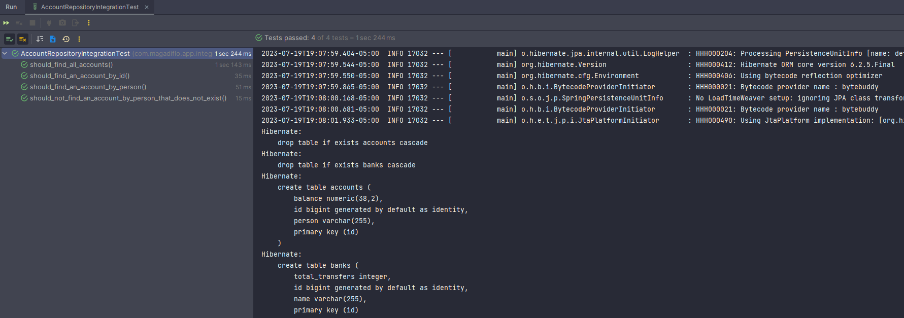

## Escribiendo pruebas para el save

````java

@DataJpaTest
class AccountRepositoryIntegrationTest {
    @Autowired
    private IAccountRepository accountRepository;

    @Test
    void should_save_an_account() {
        Account account = new Account(null, "Are", new BigDecimal("1500"));

        Account accountDB = this.accountRepository.save(account);

        assertNotNull(accountDB.getId());
        assertEquals("Are", accountDB.getPerson());
        assertEquals(1500D, accountDB.getBalance().doubleValue());
    }
}
````

## Escribiendo pruebas para el update y el delete

````java

@DataJpaTest
class AccountRepositoryIntegrationTest {
    @Autowired
    private IAccountRepository accountRepository;

    @Test
    void should_update_an_account() {
        Account account = new Account(null, "Are", new BigDecimal("1500"));

        Account accountDB = this.accountRepository.save(account);

        assertNotNull(accountDB.getId());
        assertEquals("Are", accountDB.getPerson());
        assertEquals(1500D, accountDB.getBalance().doubleValue());

        accountDB.setBalance(new BigDecimal("3800"));
        accountDB.setPerson("Karen Caldas");

        Account accountUpdated = this.accountRepository.save(accountDB);

        assertEquals(accountDB.getId(), accountUpdated.getId());
        assertEquals("Karen Caldas", accountUpdated.getPerson());
        assertEquals(3800D, accountUpdated.getBalance().doubleValue());
    }

    @Test
    void should_delete_an_account() {
        Optional<Account> accountDB = this.accountRepository.findById(1L);
        assertTrue(accountDB.isPresent());

        this.accountRepository.delete(accountDB.get());

        Optional<Account> accountDelete = this.accountRepository.findById(1L);
        assertTrue(accountDelete.isEmpty());
    }
}
````

**NOTA**

- Es importante volver a recalcar que cuando usamos la anotación **@DataJpaTest cada método test es transaccional**, eso
  significa que **hará rollback una vez finalice el método test**, de esa manera los datos vuelven a su estado original
  para dar paso al siguiente método test.
- Para comprobar el punto anterior, observemos la imagen inferior, vemos que el método test que se ejecuta primero es el
  **should_delete_an_account()** donde eliminamos el registro con id = 1L, pero luego en los otros métodos test estamos
  haciendo uso del registro con id = 1L y no estamos evidenciando problema alguno, eso es gracias a que los métodos son
  transaccionales y se está aplicando rollback de manera automática.

  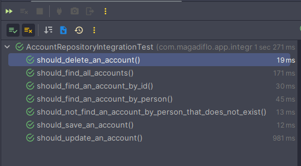

## Pruebas de Integración con @DataJpaTest usando MySQL

Primero debemos agregar el conector para mysql en el pom.xml:

````xml

<dependencies>
    <dependency>
        <groupId>com.mysql</groupId>
        <artifactId>mysql-connector-j</artifactId>
        <scope>runtime</scope>
    </dependency>
</dependencies>
````

En nuestro **application.properties** del directorio **/test/resources/** agregamos los datos de conexión a nuestra
base de datos de MySQL. Lo agregamos aquí, ya que estaremos simulando que MySQL será nuestra base de datos real para
pruebas.

````properties
# Datasource
spring.datasource.url=jdbc:mysql://localhost:3306/db_spring_boot_test?serverTimezone=America/Lima
spring.datasource.username=root
spring.datasource.password=magadiflo
spring.datasource.driver-class-name=com.mysql.cj.jdbc.Driver
# Only development
spring.jpa.hibernate.ddl-auto=create-drop
spring.jpa.show-sql=true
spring.jpa.properties.hibernate.format_sql=true
````

**NOTA**

> Como dijimos en un apartado superior, ahora solo reemplazamos los datos de nuestra base de datos real (MySQL).
> Anteriormente, usamos la misma configuración, pero con los datos de la base de datos en memoria **h2**.

Finalmente, a nuestra clase de prueba le agregamos una segunda anotación: **@AutoConfigureTestDatabase()**:

````java

@DataJpaTest
@AutoConfigureTestDatabase(replace = AutoConfigureTestDatabase.Replace.NONE)
class AccountRepositoryIntegrationTest {
    @Autowired
    private IAccountRepository accountRepository;

    @Test
    void should_find_an_account_by_id() { /* omitted code */ }

    /* other tests */
}
````

La anotación **@AutoConfigureTestDatabase** la usamos cuando queremos ejecutar las pruebas en una base de datos real.
Al usar **replace = AutoConfigureTestDatabase.Replace.NONE**, le estamos indicando a Spring Boot que no reemplace la
configuración de la base de datos existente, lo que significa que utilizará la base de datos real configurada en tu
aplicación.

A continuación vemos la ejecución de nuestras pruebas, pero esta vez usando MySQL.
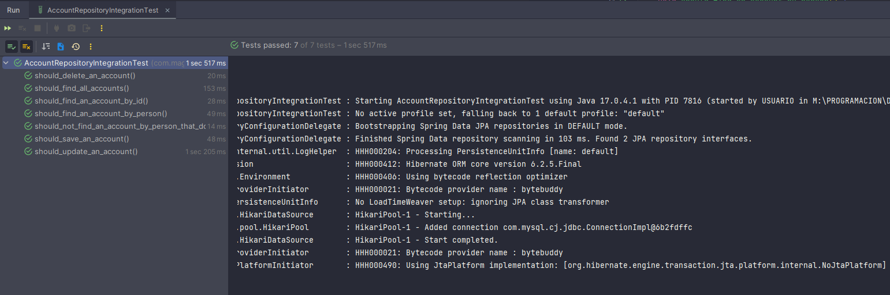

``Listo, ahora para continuar con el curso, dejaré configurado con la base de datos en memoria h2.``

# Sección 6: Spring Boot: Test de Controladores con MockMvc (WebMvcTest)

---

## Creando controller

Creamos en nuestro código fuente el controlador de nuestra aplicación. Por este capítulo solo definimos el método
**details()**:

````java

@RestController
@RequestMapping(path = "/api/v1/accounts")
public class AccountController {

    private final IAccountService accountService;

    public AccountController(IAccountService accountService) {
        this.accountService = accountService;
    }

    @GetMapping(path = "/{id}")
    public ResponseEntity<Account> details(@PathVariable Long id) {
        return this.accountService.findById(id)
                .map(ResponseEntity::ok)
                .orElseGet(() -> ResponseEntity.notFound().build());
    }
}
````

## Creando controller parte 2

Continuamos con la construcción de nuestro controlador **Account**. Necesitamos implementar el método handler
transferir, pero necesitamos un objeto que recibirá los datos en el cuerpo del request, entonces crearemos un dto
llamado **TransactionDTO** que será un **Record**, ya que solo lo usaremos para recepcionar los datos enviados en la
solicitud:

````java
public record TransactionDTO(Long bankId, Long accountIdOrigin, Long accountIdDestination, BigDecimal amount) {
}
````

Ahora creamos el método **transfer()** en nuestro controlador:

````java

@RestController
@RequestMapping(path = "/api/v1/accounts")
public class AccountController {

    private final IAccountService accountService;

    /* construct and other handler method */

    @PostMapping(path = "/transfer")
    public ResponseEntity<?> transfer(@RequestBody TransactionDTO dto) {
        this.accountService.transfer(dto.bankId(), dto.accountIdOrigin(), dto.accountIdDestination(), dto.amount());

        Map<String, Object> response = new HashMap<>();
        response.put("datetime", LocalDateTime.now());
        response.put("status", HttpStatus.OK);
        response.put("code", HttpStatus.OK.value());
        response.put("message", "transferencia exitosa");
        response.put("transaction", dto);

        return ResponseEntity.ok(response);
    }
}
````

Como más adelante usaremos clientes Http como Postman o Swagger, tenemos que configurar la transacción en la clase
service:

````java
import org.springframework.transaction.annotation.Transactional;

@Service
public class AccountServiceImpl implements IAccountService {
    /* omitted code */

    @Override
    @Transactional(readOnly = true) // (1)
    public Optional<Account> findById(Long id) { /* omitted code */ }

    @Override
    @Transactional(readOnly = true)
    public int reviewTotalTransfers(Long bancoId) { /* omitted code */ }

    @Override
    @Transactional(readOnly = true)
    public BigDecimal reviewBalance(Long accountId) { /* omitted code */ }

    @Override
    @Transactional                  // (2)
    public void transfer(Long bankId, Long accountIdOrigen, Long accountIdDestination, BigDecimal amount) { /* omitted code */ }
}
````

**DONDE**

- **(1)** el método sobre el que está anotado, internamente solo hace búsquedas, es decir solo lee de la base de datos
  algún valor buscado, no hace ninguna modificación.
- **(2)** del método **transfer()**, sí se hacen modificaciones en la base de datos, por lo tanto, debe llevar tal cual
  está la anotación @Transactional.

**DATO**

> En Spring Boot, **la anotación @Transactional se utiliza para gestionar transacciones en métodos** que forman parte de
> un servicio o capa de servicio. **Una transacción es una secuencia de operaciones que se ejecutan como una unidad
> indivisible de trabajo.** Si alguna de las **operaciones falla, se deshacen todas las operaciones realizadas hasta ese
> momento**, evitando así estados inconsistentes en la base de datos.
>
> La anotación @Transactional se puede aplicar a nivel de clase o de método. Cuando se aplica a nivel de método,
> significa que ese método se ejecutará dentro de una transacción.
>
> Cuando se establece readOnly = true, se indica que el método no realizará operaciones de escritura (modificaciones en
> la base de datos). Esto permite que Spring optimice la transacción al no realizar un commit al final de la misma, ya
> que no hay necesidad de persistir cambios en la base de datos. Pero si estando el método anotado con readOnly = true,
> se intenta realizar operaciones de escritura, se producirá una excepción en tiempo de ejecución.

## Configurando Swagger

Usaré la dependencia que se usa en el tutorial:
[Spring Boot 3 + Swagger: Documentando una API REST desde cero,](https://www.youtube.com/watch?v=-SzKqwgPTyk)
ya que esta dependencia incluye varias características, tanto la especificación de **OpenAPI** y el **Swagger-UI** para
Spring Boot 3 entre otras
([Ver artículo del mismo tutorial para más información](https://sacavix.com/2023/03/spring-boot-3-spring-doc-swagger-un-ejemplo/)):

La documentación la podemos encontrar en: **[https://springdoc.org/](https://springdoc.org/)**:

````xml
<!-- https://springdoc.org/  -->
<dependencies>
    <dependency>
        <groupId>org.springdoc</groupId>
        <artifactId>springdoc-openapi-starter-webmvc-ui</artifactId>
        <version>2.1.0</version>
    </dependency>
</dependencies>
````

**IMPORTANTE**

- Tan solo agregando la dependencia anterior **(sin configuración adicional)** nuestra aplicación de Spring Boot queda
  configurado con swagger-ui.
- La página de la interfaz de usuario de Swagger estará disponible en: ``http://localhost:8080/swagger-ui/index.html``
- La descripción de OpenAPI estará disponible en la siguiente URL para el formato
  json: ``http://localhost:8080/v3/api-docs``

**DATO**

- **OpenAPI** es una especificación. Es una especificación independiente del lenguaje que sirve para describir API REST.
  Es una serie de reglas, especificaciones y herramientas que nos ayudan a documentar nuestras APIs.
- **Swagger** es una herramienta que usa la especificación OpenAPI. Por ejemplo, OpenAPIGenerator y **SwaggerUI.**

## Configurando Base de datos MySQL

Como en nuestras dependencias ya tenemos agregado el conector a **MySQL**, agregaremos los datos de conexión a la base
de datos en el application.properties, ya que antes de hacer los tests, necesitamos verificar que la aplicación esté
funcionando. Recordar que también tenemos la dependencia de **h2**, pero esta dependencia la estamos usando para hacer
los test, mientras que la dependencia de **MySQL** lo usaremos para hacer funcionar nuestra aplicación, con nuestro
código fuente real.

``src/main/resources/application.properties``

````properties
# Datasource
spring.datasource.url=jdbc:mysql://localhost:3306/db_spring_boot_test?serverTimezone=America/Lima
spring.datasource.username=root
spring.datasource.password=magadiflo
spring.datasource.driver-class-name=com.mysql.cj.jdbc.Driver
# Only development
spring.jpa.hibernate.ddl-auto=create-drop
spring.jpa.show-sql=true
spring.jpa.properties.hibernate.format_sql=true
````

Creamos un archivo **import.sql** en la misma ruta del application.properties anterior:

``src/main/resources/import.sql``

````sql
INSERT INTO banks(name, total_transfers) VALUES('Banco de Crédito', 0);
INSERT INTO banks(name, total_transfers) VALUES('Banco Interbank', 0);
INSERT INTO banks(name, total_transfers) VALUES('Banco Scotiabank', 0);
INSERT INTO banks(name, total_transfers) VALUES('Banco BBVA', 0);

INSERT INTO accounts(person, balance) VALUES('Karen', 500);
INSERT INTO accounts(person, balance) VALUES('Miluska', 1500);
INSERT INTO accounts(person, balance) VALUES('Rosa', 750.50);
INSERT INTO accounts(person, balance) VALUES('Santiago', 260.30);
INSERT INTO accounts(person, balance) VALUES('Franz', 145.60);
````

## Pruebas Unitarias a controlador: con @WebMvcTest y MockMvc

### @WebMvcTest

- Anotación que se puede usar para una prueba de Spring MVC que se centra solo en los componentes de Spring MVC.
- El uso de esta anotación **deshabilitará la configuración automática completa** y, en su lugar, **aplicará solo la
  configuración relevante** para las pruebas de MVC, **es decir, habilitará los beans @Controller, @ControllerAdvice,
  @JsonComponent, Converter/GenericConverter, Filter, WebMvcConfigurer y HandlerMethodArgumentResolver**, pero no los
  beans @Component, @Service o @Repository beans.
- De forma predeterminada, **las pruebas anotadas con @WebMvcTest también configurarán automáticamente Spring Security y
  MockMvc.**
- Por lo general, **@WebMvcTest se usa en combinación con @MockBean o @Import** para crear cualquier colaborador
  requerido por sus beans @Controller.
- Spring nos brinda **la anotación @WebMvcTest** para facilitarnos los **test unitarios en de nuestros controladores.**
- Si colocamos el controlador dentro de la anotación **@WebMvcTest(AccountController.class)**, estamos indicándole que
  realizaremos las pruebas específicamente al controlador definido dentro de la anotación.

### MockMvc

- La anotación **@WebMvcTest permite especificar el controlador que se quiere probar** y tiene el efecto añadido que
  registra algunos beans de Spring, en particular una **instancia de la clase MockMvc**, que se puede **utilizar para
  invocar al controlador simulando la llamada HTTP sin tener que arrancar realmente ningún servidor web.**
- Es el contexto de MVC, pero falso, **el servidor HTTP es simulado**: request, response, etc. es decir, **no estamos
  trabajando sobre un servidor real HTTP**, lo que facilita la escritura de pruebas para controladores sin tener que
  iniciar un servidor web real.
- **MockMvc** ofrece una interfaz para **realizar solicitudes HTTP (GET, POST, PUT, DELETE, etc.)** a los endpoints de
  tus controladores y **obtener las respuestas simuladas.** Esto es especialmente útil para probar el comportamiento de
  tus controladores sin realizar solicitudes reales a una base de datos o a servicios externos.

### @MockBean

- La anotación **@MockBean** permite simular (mockear) el objeto sobre el cual esté anotado. Al utilizar @MockBean,
  Spring Boot reemplaza el bean original con el objeto simulado en el contexto de la aplicación durante la ejecución de
  la prueba.
- Como se mencionaba en el apartado **@WebMvcTest**, por lo general, **@WebMvcTest se usa en combinación con
  @MockBean o @Import** para crear cualquier colaborador requerido por sus beans @Controller.

### ResultActions

Permite aplicar acciones, como expectativas, sobre el resultado de una solicitud ejecutada, es decir, con esta clase
manejamos la respuesta del API REST.

### ObjectMapper

- Nos permitirá convertir cualquier objeto en un JSON y viceversa, un JSON en un objeto que por supuesto debe existir la
  clase a la que será convertido, donde los atributos de la clase coincidan con los nombres de los atributos del json y
  viceversa.
- ObjectMapper proporciona funcionalidad para leer y escribir JSON, ya sea hacia y desde POJO básicos (Plain Old Java
  Objects) o hacia y desde un modelo de árbol JSON de propósito general (JsonNode), así como la funcionalidad
  relacionada para realizar conversiones.

## Creando Prueba Unitaria al controlador AccountController

En el apartado anterior, coloqué algunas definiciones de los objetos que usaremos para crear nuestra prueba unitaria al
controlador, de esa manera tener más claro qué es lo que hace cada uno. Ahora, llegó el momento de crear la clase de
prueba:

````java

@WebMvcTest(AccountController.class)
class AccountControllerUnitTest {

    @Autowired
    private MockMvc mockMvc;
    @Autowired
    private ObjectMapper objectMapper;
    @MockBean
    private IAccountService accountService;

    @Test
    void should_find_an_account() throws Exception {
        // Given
        Long accountId = 1L;
        when(this.accountService.findById(accountId)).thenReturn(DataTest.account001());

        // When
        ResultActions response = this.mockMvc.perform(MockMvcRequestBuilders.get("/api/v1/accounts/{id}", accountId));

        // Then
        response.andExpect(MockMvcResultMatchers.status().isOk())
                .andExpect(MockMvcResultMatchers.content().contentType(MediaType.APPLICATION_JSON))
                .andExpect(MockMvcResultMatchers.jsonPath("$.person").value("Martín"))
                .andExpect(MockMvcResultMatchers.jsonPath("$.balance").value(2000));
        verify(this.accountService).findById(eq(accountId));
    }

    @Test
    void should_return_empty_when_account_does_not_exist() throws Exception {
        // Given
        Long accountId = 10L;
        when(this.accountService.findById(accountId)).thenReturn(Optional.empty());

        // When
        ResultActions response = this.mockMvc.perform(MockMvcRequestBuilders.get("/api/v1/accounts/{id}", accountId));

        // Then
        response.andExpect(MockMvcResultMatchers.status().isNotFound());
        verify(this.accountService).findById(eq(accountId));
    }
}
````

Como observamos en el código anterior, he creado dos pruebas unitarias donde se refleja un **escenario positivo** y un
**escenario negativo** al hacer una petición a la url ``/api/v1/accounts/{id}`` enviándole un id existente y un id que
no existe.

## Escribiendo pruebas para el controlador parte 2

Crearemos la prueba unitaria para nuestro endpoint **/api/v1/accounts/transfer**. Al ser un método post, estamos
enviándole información por el cuerpo de la petición, por lo tanto requerimos convertir el dto en un objeto json, aquí
entra el uso de nuestro objeto **ObjectMapper**:

````java

@WebMvcTest(AccountController.class)
class AccountControllerUnitTest {

    @Autowired
    private MockMvc mockMvc;
    @Autowired
    private ObjectMapper objectMapper;
    @MockBean
    private IAccountService accountService;

    /* omitted other tests */

    @Test
    void should_transfer_an_amount_between_accounts() throws Exception {
        // Given
        TransactionDTO dto = new TransactionDTO(1L, 1L, 2L, new BigDecimal("100"));
        doNothing().when(this.accountService).transfer(dto.bankId(), dto.accountIdOrigin(), dto.accountIdDestination(), dto.amount());

        // When
        ResultActions response = this.mockMvc.perform(MockMvcRequestBuilders.post("/api/v1/accounts/transfer")
                .contentType(MediaType.APPLICATION_JSON)
                .content(this.objectMapper.writeValueAsString(dto)));

        // Then
        response.andExpect(MockMvcResultMatchers.status().isOk())
                .andExpect(MockMvcResultMatchers.content().contentType(MediaType.APPLICATION_JSON))
                .andExpect(MockMvcResultMatchers.jsonPath("$.code").value(HttpStatus.OK.value()))
                .andExpect(MockMvcResultMatchers.jsonPath("$.datetime").exists())
                .andExpect(MockMvcResultMatchers.jsonPath("$.message").value("transferencia exitosa"))
                .andExpect(MockMvcResultMatchers.jsonPath("$.transaction.accountIdOrigin").value(dto.accountIdOrigin()));

        String jsonResponse = response.andReturn().getResponse().getContentAsString();
        JsonNode jsonNode = this.objectMapper.readTree(jsonResponse);

        String dateTime = jsonNode.get("datetime").asText();
        LocalDateTime localDateTime = LocalDateTime.parse(dateTime);

        assertEquals(LocalDate.now(), localDateTime.toLocalDate());
    }
}
````

## Ejecutando tests con cobertura de código (Code Coverage)

Para ver la cobertura de los test realizados vamos a la **raíz del proyecto** y damos **clic secundario** y
seleccionamos ``Run 'All Tests' with Coverage``. Se ejecutarán todos nuestros test, unitarios y de integración para
finalmente mostrarnos el siguiente resultado:

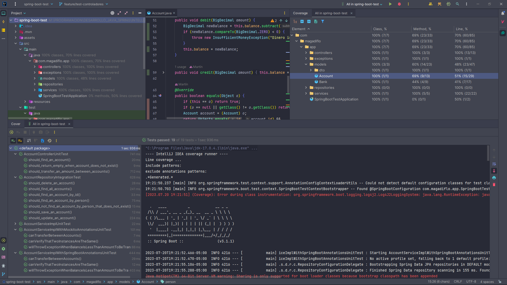

## Más Pruebas Unitarias con MockMvc - Listar

Implementamos nuevos métodos a testear: **findAll() y save()**.

````java
public interface IAccountService {
    List<Account> findAll();

    Account save(Account account);
    /* omitted other methods */
}
````

````java

@Service
public class AccountServiceImpl implements IAccountService {
    /* omitted code */

    @Override
    public List<Account> findAll() {
        return this.accountRepository.findAll();
    }

    @Override
    public Account save(Account account) {
        return this.accountRepository.save(account);
    }
    /* omitted code */

}
````

````java

@RestController
@RequestMapping(path = "/api/v1/accounts")
public class AccountController {
    /* omitted code */

    @GetMapping
    public ResponseEntity<List<Account>> listAllAccounts() {
        return ResponseEntity.ok(this.accountService.findAll());
    }

    @PostMapping
    public ResponseEntity<Account> saveAccount(@RequestBody Account account) {
        Account accountDB = this.accountService.save(account);
        URI accountURI = URI.create("/api/v1/accounts/" + accountDB.getId());
        return ResponseEntity.created(accountURI).body(accountDB);
    }
    /* omitted code */
}
````

Ahora implementamos el test para probar que el endpoint nos retorne el listado de cuentas:

````java

@WebMvcTest(AccountController.class)
class AccountControllerUnitTest {

    @Autowired
    private MockMvc mockMvc;
    @Autowired
    private ObjectMapper objectMapper;
    @MockBean
    private IAccountService accountService;

    @Test
    void should_find_all_accounts() throws Exception {
        // Given
        List<Account> accountList = List.of(DataTest.account001().get(), DataTest.account002().get());
        when(this.accountService.findAll()).thenReturn(accountList);

        // When
        ResultActions response = this.mockMvc.perform(MockMvcRequestBuilders.get("/api/v1/accounts"));

        // Then
        response.andExpect(MockMvcResultMatchers.status().isOk())
                .andExpect(MockMvcResultMatchers.content().contentType(MediaType.APPLICATION_JSON))
                .andExpect(MockMvcResultMatchers.jsonPath("$[0].person").value("Martín"))
                .andExpect(MockMvcResultMatchers.jsonPath("$[0].balance").value(2000))
                .andExpect(MockMvcResultMatchers.jsonPath("$[1].person").value("Alicia"))
                .andExpect(MockMvcResultMatchers.jsonPath("$[1].balance").value(1000))
                .andExpect(MockMvcResultMatchers.jsonPath("$.size()", Matchers.is(accountList.size())))
                .andExpect(MockMvcResultMatchers.jsonPath("$", Matchers.hasSize(accountList.size())))
                .andExpect(MockMvcResultMatchers.content().json(this.objectMapper.writeValueAsString(accountList)));

        verify(this.accountService).findAll();
    }
}
````

## Más Pruebas Unitarias con MockMvc - Guardar

````java

@WebMvcTest(AccountController.class)
class AccountControllerUnitTest {

    @Autowired
    private MockMvc mockMvc;
    @Autowired
    private ObjectMapper objectMapper;
    @MockBean
    private IAccountService accountService;

    /* omitted other tests */

    @Test
    void should_save_an_account() throws Exception {
        Long idDB = 10L;
        // Given
        Account account = new Account(null, "Martín", new BigDecimal("2000"));
        doAnswer(invocation -> {
            Account accountDB = invocation.getArgument(0);
            accountDB.setId(idDB);
            return accountDB;
        }).when(this.accountService).save(any(Account.class));

        // When
        ResultActions response = this.mockMvc.perform(MockMvcRequestBuilders.post("/api/v1/accounts")
                .contentType(MediaType.APPLICATION_JSON)
                .content(this.objectMapper.writeValueAsString(account)));

        // Then
        response.andExpect(MockMvcResultMatchers.status().isCreated())
                .andExpect(MockMvcResultMatchers.content().contentType(MediaType.APPLICATION_JSON))
                .andExpect(MockMvcResultMatchers.header().string("Location", "/api/v1/accounts/" + idDB))
                .andExpect(MockMvcResultMatchers.jsonPath("$.id", Matchers.is(idDB.intValue())))
                .andExpect(MockMvcResultMatchers.jsonPath("$.person", Matchers.is("Martín")))
                .andExpect(MockMvcResultMatchers.jsonPath("$.balance", Matchers.is(2000)));

        verify(this.accountService).save(any(Account.class));
    }
}
````

# Sección 7: Spring Boot: Test de integración de servicios rest con WebTestClient

---

## Pruebas de Integración: con WebClient

### Introducción

En esta sección **realizaremos pruebas reales** a nuestros endpoints, eso significa que **no usaremos MockMvc** para
simular las peticiones como lo hicimos en la sección anterior, aunque, viendo el tutorial de
[JavaGuides](https://www.javaguides.net/2022/03/spring-boot-integration-testing-mysql-crud-rest-api-tutorial.html#google_vignette),
allí sí usa el **MockMvc** con ciertas configuraciones para que la petición realizada sean a los endpoints reales y no
simulados, pero para nuestro caso usaremos los clientes HTTP proporcionados por Spring.

Cada vez que hagamos las pruebas de integración de nuestros endpoints, **nuestro backend debe estar levantado**, por
ejemplo en el puerto 8080; esto por una razón, nuestros tests van a consumir los endpoints reales, por lo tanto, estos
deben estar funcionando.

Para realizar estas pruebas de integración de nuestros endpoints, **usaremos clientes HTTP**, como: WebClient y
RestTemplate; estos son los principales clientes que SpringBoot ofrece para consumir Servicios Rest. En esta sección
trabajaremos con **WebClient**.

> Siempre trabajaremos con un único cliente http para realizar pruebas de integración, ya sea **utilizando RestTemplate
> o WebClient**

### WebClient

**Spring WebFlux incluye un cliente para realizar solicitudes HTTP.** WebClient tiene una API funcional y fluida basada
en Reactor. Es completamente sin bloqueo, admite transmisión y se basa en los mismos códecs que también se utilizan para
codificar y decodificar contenido de solicitud y respuesta en el lado del servidor.

**WebClient** es un cliente HTTP de **Spring** que permite realizar solicitudes HTTP de manera reactiva y no bloqueante
en aplicaciones basadas en Spring. Es una opción recomendada para nuevas aplicaciones y reemplaza gradualmente a
RestTemplate en el ecosistema de Spring.

### WebTestClient

**WebTestClient es un cliente HTTP** diseñado para probar aplicaciones de servidor. **Envuelve el WebClient de Spring**
y lo usa para realizar solicitudes, pero expone una fachada de prueba para verificar las respuestas. WebTestClient se
puede utilizar para realizar pruebas HTTP de extremo a extremo. También se puede usar para probar aplicaciones Spring
MVC y Spring WebFlux sin un servidor en ejecución a través de objetos de respuesta y solicitud de servidor simulados.

Por lo tanto, **para trabajar con el cliente HTTP WebClient**, o para ser más precisos con **WebTestClient**,
necesitamos agregar la siguiente dependencia:

````xml

<dependencies>
    <dependency>
        <groupId>org.springframework.boot</groupId>
        <artifactId>spring-boot-starter-webflux</artifactId>
        <scope>test</scope>
    </dependency>
</dependencies>
````

**NOTA**
> Observar que el **scope** de la dependencia de webflux lo colocamos en **test**, puesto que será usado en nuestra
> aplicación solo para eso, realizar pruebas.

### @SpringBootTest()

Spring Boot proporciona esta anotación **(@SpringBootTest)** para realizar pruebas de integración. Esta anotación crea
un contexto de aplicación y carga el contexto completo de la aplicación.

**@SpringBootTest** arranca el contexto completo de la aplicación, lo que significa que podemos usar el **@Autowired**
para poder usar **inyección de dependencia**. Inicia un servidor embebido, crea un entorno web y, a continuación,
permite a los métodos **@Test** realizar pruebas de integración.

### webEnvironment = SpringBootTest.WebEnvironment.RANDOM_PORT

De forma predeterminada **@SpringBootTest** no inicia un servidor, necesitamos agregar el atributo **webEnvironment**
para refinar aún más cómo se ejecutarán sus pruebas. Tiene varias opciones:

- **MOCK(default)**, carga un contexto de aplicación web y proporciona un entorno web simulado.
- **RANDOM_PORT**, carga un WebServerApplicationContext y **proporciona un entorno web real.** El servidor embebido se
  inicia y escucha en un puerto aleatorio. **Este es el que se debe utilizar para la prueba de integración.**
- **DEFINED_PORT**, carga un WebServerApplicationContext y proporciona un entorno web real.
- **NONE**, carga un ApplicationContext usando SpringApplication, pero no proporciona ningún entorno web.

## Creando nuestra clase de prueba de integración con WebTestClient

Luego de haber visto los conceptos necesarios para entender lo que se usa en el código de test, procedo a mostrar el
primer test de integración creado:

````java

@SpringBootTest(webEnvironment = SpringBootTest.WebEnvironment.RANDOM_PORT)
class AccountControllerWebTestClientIntegrationTest {

    @Autowired
    private WebTestClient client;
    @Autowired
    private ObjectMapper objectMapper;

    @Test
    void should_transfer_amount_between_two_accounts() {
        // Given
        TransactionDTO dto = new TransactionDTO(1L, 1L, 2L, new BigDecimal("100"));

        // When
        WebTestClient.ResponseSpec response = this.client.post().uri("http://localhost:8080/api/v1/accounts/transfer") //(1)
                .contentType(MediaType.APPLICATION_JSON)
                .bodyValue(dto)     // (2)
                .exchange();        // (3)

        // Then
        response.expectStatus().isOk()
                .expectBody()
                .jsonPath("$.message").isNotEmpty()
                .jsonPath("$.message").value(Matchers.is("transferencia exitosa"))
                .jsonPath("$.message").value(message -> assertEquals("transferencia exitosa", message))
                .jsonPath("$.message").isEqualTo("transferencia exitosa")
                .jsonPath("$.transaction.accountIdOrigin").isEqualTo(dto.accountIdOrigin())
                .jsonPath("$.datetime").value(datetime -> {
                    LocalDateTime localDateTime = LocalDateTime.parse(datetime.toString());
                    assertEquals(LocalDate.now(), localDateTime.toLocalDate());
                });
    }
}
````

**DONDE**

- **(1)** url completa donde se está ejecutando nuestro endpoint a ser testeado.
- **(2)** el método **bodyValue()** por debajo convierte al objeto pasado en un JSON.
- **(3)** el método **exchange()**, ejecuta el envío de la solicitud, lo que venga después del **exchange()** es la
  respuesta.

## Ejecutando nuestro test de integración - Instancias separadas

Si **solo ejecutamos el test anterior, sin hacer nada más** observamos el siguiente resultado:

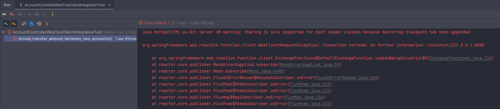

El error mostrado ``Connection refused: no further information: localhost/127.0.0.1:8080`` nos dice que no ha encontrado
algún servidor ejecutándose en esa dirección. Eso tiene sentido, ya que **solo ejecutamos nuestra clase de test** sin
haber hecho nada más.

Lo que debemos realizar **antes de ejecutar el test es levantar nuestro proyecto real**, una vez levantado el proyecto
real, allí recién ejecutaremos nuestro test. **Recordar que nuestro proyecto real está trabajando con MySQL así que
también debemos tener levantado esa base de datos.**

Una **vez tengamos levantado el proyecto real, vamos a nuestro test de integración y lo ejecutamos.** Nuestro test se
levantará en su propio servidor y en otro puerto distinto al de la aplicación real, esto gracias al **RANDOM_PORT**.

Observamos en la siguiente imagen que tenemos levantado nuestra aplicación real y además al ejecutar nuestro test de
integración, este lo hace en otro servidor.

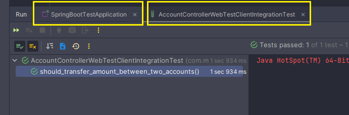

**NOTA**

> Debemos ejecutar este test levantando estas dos instancias, ya que en el
> ``uri("http://localhost:8080/api/v1/accounts/transfer")`` colocamos la ruta completa y eso nos obliga a tener que
> trabajar con estas dos instancias, por un lado, ejecutar previamente el Servidor de la Aplicación Backend y por otro
> ejecutar el test de integración en su propio servidor de esa manera cada servidor se ejecutará en un puerto distinto,
> el de nuestro backend en el puerto 8080 y el del test en uno aleatorio.


``Con el proyecto real levantado y antes de ejecutar el test``

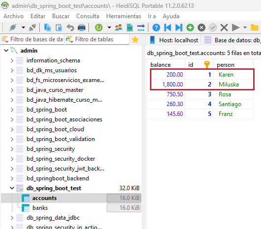

``Con el proyecto real levantado y después de ejecutar el test``

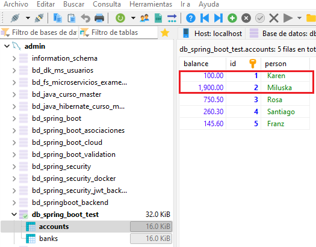

Por lo tanto, es importante tener los datos iniciados en la base de datos, **que no hayan sido modificados por otro
proceso u otro test de integración,** ya que como vemos se está usando los datos reales de la base de datos, por eso
**es importante partir de cero y reiniciar el servidor antes de ejecutar nuestros test de integración.**

## Ejecutando nuestro test de integración - Única Instancia

Cuando nuestras **pruebas de integración estén dentro del mismo proyecto backend**, es decir, dentro del mismo proyecto
que contiene el controlador que queremos probar, **no es necesario tener levantado previamente el backend** para luego
ejecutar el test de integración, tal como lo hicimos en el capítulo anterior. Para que esto sea así, debemos modificar
el **uri()** del test para que tenga la ruta relativa al proyecto ``uri("/api/v1/accounts/transfer")`` y no la ruta
completa como lo teníamos antes.

Al colocar la **ruta relativa** en el test, por defecto, tanto el backend como el test de integración estarán en el
mismo servidor y con el mismo puerto aleatorio generado.

Modificando el método **uri()** nuestra clase de test de integración quedaría de esta manera:

````java

@SpringBootTest(webEnvironment = SpringBootTest.WebEnvironment.RANDOM_PORT)
class AccountControllerWebTestClientIntegrationTest {

    @Autowired
    private WebTestClient client;
    @Autowired
    private ObjectMapper objectMapper;

    @Test
    void should_transfer_amount_between_two_accounts() {
        // Given
        TransactionDTO dto = new TransactionDTO(1L, 1L, 2L, new BigDecimal("100"));

        // When
        WebTestClient.ResponseSpec response = this.client.post().uri("/api/v1/accounts/transfer") //<-- path relativo
                .contentType(MediaType.APPLICATION_JSON)
                .bodyValue(dto)
                .exchange();

        // Then
        response.expectStatus().isOk()
                .expectBody()
                .jsonPath("$.message").isNotEmpty()
                .jsonPath("$.message").value(Matchers.is("transferencia exitosa"))
                .jsonPath("$.message").value(message -> assertEquals("transferencia exitosa", message))
                .jsonPath("$.message").isEqualTo("transferencia exitosa")
                .jsonPath("$.transaction.accountIdOrigin").isEqualTo(dto.accountIdOrigin())
                .jsonPath("$.datetime").value(datetime -> {
                    LocalDateTime localDateTime = LocalDateTime.parse(datetime.toString());
                    assertEquals(LocalDate.now(), localDateTime.toLocalDate());
                });
    }
}
````

Ahora sí, **ejecutamos solo el test de integración** y como resultado veremos una ejecución exitosa en una sola
instancia. Además, de esta manera usamos la base de datos **h2** y **no la de MySQL**. Recordemos que en las
dependencias del **pom.xml** configuramos la dependencia de **h2 con scope en test**. Por lo tanto, ahora usará los
datos que estén poblados en la base de datos de **h2** o la que tengamos configurado en el **application.properties**
de nuestro **/test/resources/application.properties**:

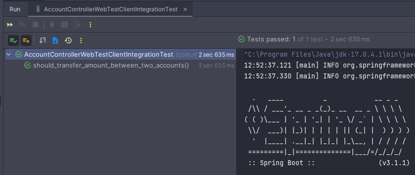

**NOTA**

> Si nuestra aplicación backend está separada de nuestros test de integración, obviamente allí sí debemos usar la ruta
> completa tal como lo hicimos en el apartado **Ejecutando nuestro test de integración - Instancias separadas**

## Prueba de Integración - Usando .consumeWith()

En el test anterior usamos el **jsonPath()** para comprobar los resultados esperados y actuales, tal como se ve en
el siguiente extracto de código:

````java

@SpringBootTest(webEnvironment = SpringBootTest.WebEnvironment.RANDOM_PORT)
class AccountControllerWebTestClientIntegrationTest {
    /* omitted code */

    @Test
    void should_transfer_amount_between_two_accounts() {
        /* omitted code */
        // Then
        response.expectStatus().isOk()
                .expectBody()
                .jsonPath("$.message").isNotEmpty()
                .jsonPath("$.message").value(Matchers.is("transferencia exitosa"))
                .jsonPath("$.message").value(message -> assertEquals("transferencia exitosa", message))
                .jsonPath("$.message").isEqualTo("transferencia exitosa")
                .jsonPath("$.transaction.accountIdOrigin").isEqualTo(dto.accountIdOrigin())
                .jsonPath("$.datetime").value(datetime -> {
                    LocalDateTime localDateTime = LocalDateTime.parse(datetime.toString());
                    assertEquals(LocalDate.now(), localDateTime.toLocalDate());
                });

    }
}
````

Existe otra forma de realizar la misma comprobación y es usando el método **.consumeWith()**. El consumeWith() recibe
dentro de su método una expresión lambda que le permitirá consumir la respuesta y hacer los asserts:

````java

@SpringBootTest(webEnvironment = SpringBootTest.WebEnvironment.RANDOM_PORT)
class AccountControllerWebTestClientIntegrationTest {

    @Autowired
    private WebTestClient client;
    @Autowired
    private ObjectMapper objectMapper;

    @Test
    void should_transfer_amount_between_two_accounts_with_consumeWith() {
        // Given
        TransactionDTO dto = new TransactionDTO(1L, 1L, 2L, new BigDecimal("20"));

        // When
        WebTestClient.ResponseSpec response = this.client.post().uri("/api/v1/accounts/transfer")
                .contentType(MediaType.APPLICATION_JSON)
                .bodyValue(dto)
                .exchange();

        // Then
        response.expectStatus().isOk()
                .expectBody()
                .consumeWith(result -> { //<-- Otra forma de poder realizar la comprobación
                    try {
                        JsonNode jsonNode = this.objectMapper.readTree(result.getResponseBody());

                        assertEquals("transferencia exitosa", jsonNode.path("message").asText());
                        assertEquals(dto.accountIdOrigin(), jsonNode.path("transaction").path("accountIdOrigin").asLong());
                        assertEquals(dto.amount().doubleValue(), jsonNode.path("transaction").path("amount").asDouble());

                        LocalDateTime localDateTime = LocalDateTime.parse(jsonNode.path("datetime").asText());
                        assertEquals(LocalDate.now(), localDateTime.toLocalDate());
                    } catch (IOException e) {
                        throw new RuntimeException(e);
                    }
                });
    }
}
````

## Test de Integración: para el endpoint de details

Nuestro nuevo método test evaluará el endpoint de detalles, para este caso usaremos el **jsonPath()** para hacer las
comprobaciones:

````java

@SpringBootTest(webEnvironment = SpringBootTest.WebEnvironment.RANDOM_PORT)
class AccountControllerWebTestClientIntegrationTest {

    @Autowired
    private WebTestClient client;
    @Autowired
    private ObjectMapper objectMapper;

    @Test
    void should_find_an_account_with_jsonPath() throws JsonProcessingException {
        // Given
        Long id = 1L;
        Account expectedAccount = new Account(id, "Martín", new BigDecimal("2000"));

        // When
        WebTestClient.ResponseSpec response = this.client.get().uri("/api/v1/accounts/{id}", id).exchange();

        // Then
        response.expectStatus().isOk()
                .expectHeader().contentType(MediaType.APPLICATION_JSON)
                .expectBody()
                .jsonPath("$.person").isEqualTo(expectedAccount.getPerson())
                .jsonPath("$.balance").isEqualTo(expectedAccount.getBalance().doubleValue())
                .json(this.objectMapper.writeValueAsString(expectedAccount)); // Comparamos el json obtenido con un json esperado

    }
}
````

**NOTA**
> Como hasta ahora tenemos 3 métodos test, dependiendo de cuál sea el orden que JUnit ejecute cada test veremos que la
> base de datos se verá afectada, pudiendo afectar la ejecución de alguno de los test. A lo que me refiero es a que por
> ejemplo en este último test para el usuario con id=1 se espera recibir 2000 como saldo, pero puede ser que el test
> donde evaluamos las transacciones se ejecute antes modificando ese saldo, de tal forma que cuando le toque la hora de
> ejecutar el nuestro test de detalle ya no se tendrá el saldo de 2000. Por lo tanto, habrá que ver la manera de cómo
> manejar esa situación.

Para ver lo que se menciona en la **NOTA** crearemos otro método de test similar al anterior, pero esta vez usaremos el
**consumeWith()** que es otra forma de manejar las respuestas.

````java

@SpringBootTest(webEnvironment = SpringBootTest.WebEnvironment.RANDOM_PORT)
class AccountControllerWebTestClientIntegrationTest {

    @Autowired
    private WebTestClient client;
    @Autowired
    private ObjectMapper objectMapper;

    @Test
    void should_find_an_account_with_consumeWith() throws JsonProcessingException {
        // Given
        Long id = 2L;
        Account expectedAccount = new Account(2L, "Alicia", new BigDecimal("1000"));

        // When
        WebTestClient.ResponseSpec response = this.client.get().uri("/api/v1/accounts/{id}", id).exchange();

        // Then
        response.expectStatus().isOk()
                .expectHeader().contentType(MediaType.APPLICATION_JSON)
                .expectBody(Account.class)//Se espera recibir un json que tenga exactamente los mismos atributos que la clase Account
                .consumeWith(result -> {
                    Account accountDB = result.getResponseBody();

                    assertNotNull(accountDB);
                    assertEquals(expectedAccount, accountDB);
                    assertEquals(expectedAccount.getPerson(), accountDB.getPerson());
                    assertEquals(expectedAccount.getBalance(), accountDB.getBalance());
                });

    }
}
````

Con este último método test tendríamos 4 test creados en nuestra clase de prueba. Si ejecutamos todos los métodos test
veremos que, dependiendo del orden, uno de los test puede fallar, ya que estará esperando un dato distinto al devuelvo
puesto que fue modificado por otro test. Eso lo vemos en la siguiente imagen:

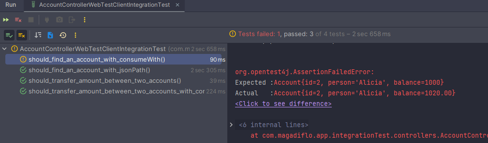

> Entonces, como recomendación, cuando ejecutemos nuestras **pruebas de integración** donde algunos **test modifican
> datos de la base de datos**, podríamos dar algún tipo de prioridad, es decir, definir que se ejecute un método
> determinado, luego otro y así (darle un orden a los test), pero **solo en pruebas de integración**, para que un
> método que se ejecutó antes no afecte a otro método que se ejecutará después.

## Test de Integración - Agregando @Order a los @Test

Como se vio en la sección anterior, cuando ejecutamos nuestros **tes de integración** los test puede verse afectados por
la ejecución de otros test, así que lo recomendable será darle un orden a cada método test, pero solo cuando realizamos
más de una **prueba de integración**.

Utilizaremos las siguientes anotaciones:

- **@TestMethodOrder** es una anotación de nivel de tipo que se usa para configurar un MethodOrderer para los métodos de
  prueba de la clase de prueba anotada o la interfaz de prueba. En este contexto, el término "método de prueba" se
  refiere a cualquier método anotado con @Test, @RepeatedTest, @ParameterizedTest, @TestFactory o @TestTemplate.


- **@Order** es una anotación que se utiliza para configurar el orden en que el elemento anotado (es decir, campo,
  método o clase) debe evaluarse o ejecutarse en relación con otros elementos de la misma categoría.
  Cuando se usa con @RegisterExtension o @ExtendWith, la categoría se aplica a los campos de extensión. Cuando se usa
  con MethodOrderer.OrderAnnotation, la categoría se aplica a los métodos de prueba. Cuando se usa con
  ClassOrderer.OrderAnnotation, la categoría se aplica a las clases de prueba.

A continuación se muestra toda la clase test con sus métodos test ordenados con la anotación **@Order()**, además con
la modificación de los **datos esperados**:

````java

@TestMethodOrder(MethodOrderer.OrderAnnotation.class)
@SpringBootTest(webEnvironment = SpringBootTest.WebEnvironment.RANDOM_PORT)
class AccountControllerWebTestClientIntegrationTest {

    @Autowired
    private WebTestClient client;
    @Autowired
    private ObjectMapper objectMapper;

    @Test
    @Order(1)
    void should_transfer_amount_between_two_accounts() {
        // Given
        TransactionDTO dto = new TransactionDTO(1L, 1L, 2L, new BigDecimal("100"));

        // When
        WebTestClient.ResponseSpec response = this.client.post().uri("/api/v1/accounts/transfer")
                .contentType(MediaType.APPLICATION_JSON)
                .bodyValue(dto)
                .exchange();

        // Then
        response.expectStatus().isOk()
                .expectBody()
                .jsonPath("$.message").isNotEmpty()
                .jsonPath("$.message").value(Matchers.is("transferencia exitosa"))
                .jsonPath("$.message").value(message -> assertEquals("transferencia exitosa", message))
                .jsonPath("$.message").isEqualTo("transferencia exitosa")
                .jsonPath("$.transaction.accountIdOrigin").isEqualTo(dto.accountIdOrigin())
                .jsonPath("$.datetime").value(datetime -> {
                    LocalDateTime localDateTime = LocalDateTime.parse(datetime.toString());
                    assertEquals(LocalDate.now(), localDateTime.toLocalDate());
                });
    }

    @Test
    @Order(2)
    void should_transfer_amount_between_two_accounts_with_consumeWith() {
        // Given
        TransactionDTO dto = new TransactionDTO(1L, 1L, 2L, new BigDecimal("20"));

        // When
        WebTestClient.ResponseSpec response = this.client.post().uri("/api/v1/accounts/transfer")
                .contentType(MediaType.APPLICATION_JSON)
                .bodyValue(dto)
                .exchange();

        // Then
        response.expectStatus().isOk()
                .expectBody()
                .consumeWith(result -> {
                    try {
                        JsonNode jsonNode = this.objectMapper.readTree(result.getResponseBody());

                        assertEquals("transferencia exitosa", jsonNode.path("message").asText());
                        assertEquals(dto.accountIdOrigin(), jsonNode.path("transaction").path("accountIdOrigin").asLong());
                        assertEquals(dto.amount().doubleValue(), jsonNode.path("transaction").path("amount").asDouble());

                        LocalDateTime localDateTime = LocalDateTime.parse(jsonNode.path("datetime").asText());
                        assertEquals(LocalDate.now(), localDateTime.toLocalDate());
                    } catch (IOException e) {
                        throw new RuntimeException(e);
                    }
                });
    }

    @Test
    @Order(3)
    void should_find_an_account_with_jsonPath() throws JsonProcessingException {
        // Given
        Long id = 1L;
        Account expectedAccount = new Account(id, "Martín", new BigDecimal("1880"));

        // When
        WebTestClient.ResponseSpec response = this.client.get().uri("/api/v1/accounts/{id}", id).exchange();

        // Then
        response.expectStatus().isOk()
                .expectHeader().contentType(MediaType.APPLICATION_JSON)
                .expectBody()
                .jsonPath("$.person").isEqualTo(expectedAccount.getPerson())
                .jsonPath("$.balance").isEqualTo(expectedAccount.getBalance().doubleValue())
                .json(this.objectMapper.writeValueAsString(expectedAccount));

    }

    @Test
    @Order(4)
    void should_find_an_account_with_consumeWith() throws JsonProcessingException {
        // Given
        Long id = 2L;
        Account expectedAccount = new Account(2L, "Alicia", new BigDecimal("1120.00"));

        // When
        WebTestClient.ResponseSpec response = this.client.get().uri("/api/v1/accounts/{id}", id).exchange();

        // Then
        response.expectStatus().isOk()
                .expectHeader().contentType(MediaType.APPLICATION_JSON)
                .expectBody(Account.class)//Se espera recibir un json que tenga exactamente los mismos atributos que la clase Account
                .consumeWith(result -> {
                    Account accountDB = result.getResponseBody();

                    assertNotNull(accountDB);
                    assertEquals(expectedAccount, accountDB);
                    assertEquals(expectedAccount.getPerson(), accountDB.getPerson());
                    assertEquals(expectedAccount.getBalance(), accountDB.getBalance());
                });

    }
}
````

Ahora, si ejecutamos los test veremos que todos pasarán exitosamente. **El orden que se muestra en los resultados no
interesa, lo importante es que sabemos en qué orden se están ejecutando los test por la anotación @Order**:

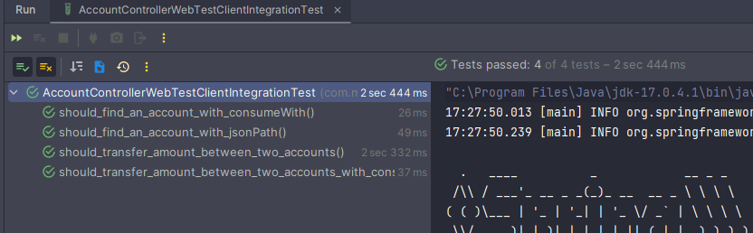

## Test de Integración: para el listar

````java

@TestMethodOrder(MethodOrderer.OrderAnnotation.class)
@SpringBootTest(webEnvironment = SpringBootTest.WebEnvironment.RANDOM_PORT)
class AccountControllerWebTestClientIntegrationTest {

    @Autowired
    private WebTestClient client;
    @Autowired
    private ObjectMapper objectMapper;

    @Test
    @Order(5)
    void should_find_all_accounts_with_jsonPath() {
        // When
        WebTestClient.ResponseSpec response = this.client.get().uri("/api/v1/accounts").exchange();

        // Then
        response.expectStatus().isOk()
                .expectHeader().contentType(MediaType.APPLICATION_JSON)
                .expectBody()
                .jsonPath("$").isArray()
                .jsonPath("$").value(Matchers.hasSize(2))
                .jsonPath("$.size()").isEqualTo(2)
                .jsonPath("$[0].id").isEqualTo(1)
                .jsonPath("$[0].person").isEqualTo("Martín")
                .jsonPath("$[0].balance").isEqualTo(1880)
                .jsonPath("$[1].id").isEqualTo(2)
                .jsonPath("$[1].person").isEqualTo("Alicia")
                .jsonPath("$[1].balance").isEqualTo(1120);
    }

    @Test
    @Order(5)
    void should_find_all_accounts_with_consumeWith() {
        // When
        WebTestClient.ResponseSpec response = this.client.get().uri("/api/v1/accounts").exchange();

        // Then
        response.expectStatus().isOk()
                .expectHeader().contentType(MediaType.APPLICATION_JSON)
                .expectBodyList(Account.class) // Como es del tipo expectBodyList, nos da la posibilidad de usar los métodos (1)
                .consumeWith(result -> {
                    List<Account> accountListDB = result.getResponseBody();

                    assertNotNull(accountListDB);
                    assertFalse(accountListDB.isEmpty());
                    assertEquals(2, accountListDB.size());
                    assertEquals(1L, accountListDB.get(0).getId());
                    assertEquals("Martín", accountListDB.get(0).getPerson());
                    assertEquals(1880D, accountListDB.get(0).getBalance().doubleValue());
                    assertEquals(2L, accountListDB.get(1).getId());
                    assertEquals("Alicia", accountListDB.get(1).getPerson());
                    assertEquals(1120D, accountListDB.get(1).getBalance().doubleValue());
                })
                .hasSize(2)                     // <-- (1)
                .value(Matchers.hasSize(2));    // <-- (1) y otros métodos más.
    }
}
````

## Test de Integración: para el guardar

````java

@TestMethodOrder(MethodOrderer.OrderAnnotation.class)
@SpringBootTest(webEnvironment = SpringBootTest.WebEnvironment.RANDOM_PORT)
class AccountControllerWebTestClientIntegrationTest {

    @Autowired
    private WebTestClient client;
    @Autowired
    private ObjectMapper objectMapper;

    @Test
    @Order(6)
    void should_save_an_account_with_jsonPath() {
        // Given
        Long idDB = 3L;
        Account accountToSave = new Account(null, "María", new BigDecimal("5000"));

        // When
        WebTestClient.ResponseSpec response = this.client.post().uri("/api/v1/accounts")
                .contentType(MediaType.APPLICATION_JSON)
                .bodyValue(accountToSave)
                .exchange();

        // Then
        response.expectStatus().isCreated()
                .expectHeader().contentType(MediaType.APPLICATION_JSON)
                .expectHeader().location("/api/v1/accounts/" + idDB)
                .expectBody()
                .jsonPath("$.id").isEqualTo(idDB)
                .jsonPath("$.person").value(Matchers.is(accountToSave.getPerson()))
                .jsonPath("$.balance").isEqualTo(accountToSave.getBalance());
    }

    @Test
    @Order(7)
    void should_save_an_account_with_consumeWith() {
        // Given
        Long idDB = 4L;
        Account accountToSave = new Account(null, "Livved", new BigDecimal("3000"));

        // When
        WebTestClient.ResponseSpec response = this.client.post().uri("/api/v1/accounts")
                .contentType(MediaType.APPLICATION_JSON)
                .bodyValue(accountToSave)
                .exchange();

        // Then
        response.expectStatus().isCreated()
                .expectHeader().contentType(MediaType.APPLICATION_JSON)
                .expectHeader().location("/api/v1/accounts/" + idDB)
                .expectBody(Account.class)
                .consumeWith(result -> {
                    Account accountDB = result.getResponseBody();

                    assertNotNull(accountDB);
                    assertEquals(idDB, accountDB.getId());
                    assertEquals(accountToSave.getPerson(), accountDB.getPerson());
                    assertEquals(accountToSave.getBalance(), accountDB.getBalance());
                });
    }
}
````

## Test de Integración: para el eliminar

Para realizar el test de integración del eliminar, primero debemos implementar dicha funcionalidad:

````java
public interface IAccountService {
    /* other methods */
    Optional<Boolean> deleteAccountById(Long id);
}
````

````java

@Service
public class AccountServiceImpl implements IAccountService {
    /* omitted code */
    @Override
    @Transactional
    public Optional<Boolean> deleteAccountById(Long id) {
        return this.accountRepository.findById(id)
                .map(accountDB -> {
                    this.accountRepository.deleteById(accountDB.getId());
                    return true;
                });
    }
}
````

````java

@RestController
@RequestMapping(path = "/api/v1/accounts")
public class AccountController {
    /* omitted code */
    @DeleteMapping(path = "/{id}")
    public ResponseEntity<?> deleteAccount(@PathVariable Long id) {
        return this.accountService.deleteAccountById(id)
                .map(isDeleted -> ResponseEntity.noContent().build())
                .orElseGet(() -> ResponseEntity.notFound().build());
    }
}
````

Listo, una vez implementada la funcionalidad del eliminar, toca realizar el test de integración:

````java

@TestMethodOrder(MethodOrderer.OrderAnnotation.class)
@SpringBootTest(webEnvironment = SpringBootTest.WebEnvironment.RANDOM_PORT)
class AccountControllerWebTestClientIntegrationTest {

    @Autowired
    private WebTestClient client;
    @Autowired
    private ObjectMapper objectMapper;

    @Test
    @Order(8)
    void should_deleted_an_account() {
        // Given
        Long idToDelete = 1L;
        this.client.get().uri("/api/v1/accounts")
                .exchange()
                .expectStatus().isOk()
                .expectBodyList(Account.class)
                .hasSize(4);

        // When
        WebTestClient.ResponseSpec response = this.client.delete().uri("/api/v1/accounts/{id}", idToDelete)
                .exchange();

        // Then
        response.expectStatus().isNoContent()
                .expectBody().isEmpty();

        this.client.get().uri("/api/v1/accounts")
                .exchange()
                .expectStatus().isOk()
                .expectBodyList(Account.class)
                .hasSize(3);

        this.client.get().uri("/api/cuentas/{id}", idToDelete)
                .exchange()
                .expectStatus().isNotFound()
                .expectBody()
                .jsonPath("$.status").isEqualTo(404)
                .jsonPath("$.error").isEqualTo("Not Found");
    }
}
````

# Sección 8: Spring Boot: Test de Integración de Servicios Rest con TestRestTemplate

---

## Pruebas de Integración con TestRestTemplate

Crearemos nuestra clase de prueba a partir del controlador **AccountController** presionando las teclas
``Ctrl + Shift + T``. Las configuraciones serán las mismas que utilizamos en las pruebas de integración usando
**WebClient**, con algunas diferencias:

1. Como ahora utilizaremos **TestRestTemplate** necesitamos definirlo como una propiedad que será inyectada con
   @Autowired.
2. En las **Pruebas de Integración usando WebTestClient** usábamos la anotación **@Order()** con la anotación
   **@TestMethodOrder()** a nivel de la clase, con la finalidad de determinar el orden de ejecución de los test, con
   esto evitábamos que la ejecución de un test que modificaba la base de datos no afectara la ejecución de otro test que
   usaba los mismos datos. Pues bien, en esta nueva sección ya no usaremos esas anotaciones para ordenar los test,
   sino más bien, **usaremos la anotación @Sql() junto con algunos scripts SQL para tener los datos de pruebas siempre
   en un mismo estado**.

### TestRestTemplate

Alternativa conveniente de RestTemplate que **es adecuada para pruebas de integración.** TestRestTemplate es tolerante a
fallas. Esto significa que 4xx y 5xx no generan una excepción y, en cambio, pueden detectarse a través de la entidad de
respuesta y su código de estado.

Una TestRestTemplate puede llevar opcionalmente encabezados de autenticación básicos. Si Apache Http Client 4.3.2 o
superior está disponible (recomendado), se utilizará como cliente y, de forma predeterminada, se configurará para
ignorar las cookies y los redireccionamientos.

**Nota: para evitar problemas de inyección, esta clase no extiende intencionadamente RestTemplate. Si necesita acceder
al RestTemplate subyacente, use getRestTemplate().**

**Si está utilizando la anotación @SpringBootTest con un servidor integrado, un TestRestTemplate está disponible
automáticamente y se puede @Autowired en su prueba.** Si necesita personalizaciones (por ejemplo, para agregar
convertidores de mensajes adicionales), use RestTemplateBuilder @Bean.

### [Ejecutando Scripts SQL](https://docs.spring.io/spring-framework/reference/testing/testcontext-framework/executing-sql.html#testcontext-executing-sql-declaratively-script-detection)

Cuando se escriben **pruebas de integración** en una base de datos relacional, **suele ser beneficioso ejecutar
secuencias de comandos SQL para modificar el esquema de la base de datos o insertar datos de prueba en las tablas.** El
módulo spring-jdbc brinda soporte para inicializar una base de datos incrustada o existente mediante la ejecución de
secuencias de comandos SQL cuando se carga Spring ApplicationContext.

Aunque es muy útil inicializar una base de datos para probar una vez que se carga ApplicationContext, a veces es
esencial poder **modificar la base de datos durante las pruebas de integración.**

### Ejecutar scripts SQL declarativamente con @Sql

Puede declarar la **anotación @Sql en una clase de prueba o método de prueba** para configurar instrucciones SQL
individuales o las rutas de recursos a **scripts SQL que deben ejecutarse en una base de datos determinada antes o
después de un método de prueba de integración.**

### Semántica de recursos de ruta

Cada ruta se interpreta como un recurso Spring:

- Una ruta simple, por ejemplo: **"schema.sql"** se trata como un recurso de ruta de clase **relativo al paquete en el
  que se define la clase de prueba.**
- Una ruta que comienza con una barra inclinada **se trata como un recurso de ruta de clase absoluta**, por ejemplo:
  **"/org/example/schema.sql".**
- Una ruta que hace referencia a una URL, por ejemplo: **una ruta con el prefijo classpath:, file:, http:**, se carga
  utilizando el protocolo de recursos especificado.

Si queremos ubicar nuestros Scripts SQL en el directorio **/test/resources** debemos usar la siguiente semántica de
recursos de ruta:

````
scripts = {"/test-account-cleanup.sql", "/test-account-data.sql"}
````

En nuestro caso, definiremos dos scripts sql, el primero hará un truncate de toda la tabla **accounts**, pero según
revisé, ese truncate no reinicia el contador de incremento de los ids, así que por eso se hace uso de un ALTER TABLE
para reiniciar la columna id a 1.

El segundo script puebla la tabla **accounts** y también la de **banks**. **Estos dos scripts se ejecutarán antes de
cada método de prueba individual.**

````
# test-account-cleanup.sql
#
TRUNCATE TABLE accounts;
ALTER TABLE accounts ALTER COLUMN id RESTART WITH 1;
````

````
# test-account-data.sql
#
INSERT INTO banks(name, total_transfers) VALUES('Banco de la Nación', 0);
INSERT INTO banks(name, total_transfers) VALUES('Banco BBVA', 0);
INSERT INTO banks(name, total_transfers) VALUES('Banco BCP', 0);

INSERT INTO accounts(person, balance) VALUES('Andrés', 1000);
INSERT INTO accounts(person, balance) VALUES('Pedro', 2000);
INSERT INTO accounts(person, balance) VALUES('Liz', 3000);
INSERT INTO accounts(person, balance) VALUES('Karen', 4000);
````

Para que nuestros scripts y declaraciones SQL configurados en la anotación **@Sql**, se ejecuten **antes que el método
de prueba correspondiente**, debemos usar la siguiente configuración:

````
executionPhase = Sql.ExecutionPhase.BEFORE_TEST_METHOD
````

En resumen, con esta anotación
``@Sql(scripts = {"/test-account-cleanup.sql", "/test-account-data.sql"}, executionPhase = Sql.ExecutionPhase.BEFORE_TEST_METHOD)``,
estás indicando que antes de ejecutar cada método de prueba, se ejecuten los scripts SQL mencionados. Esto puede ser
útil para preparar la base de datos con datos de prueba o limpiarla después de la ejecución de cada prueba, asegurando
que las pruebas se ejecuten en un estado predecible y limpio.

## Prueba de Integración con TestRestTemplate: primer test endpoint transfer

````java

@Sql(scripts = {"/test-account-cleanup.sql", "/test-account-data.sql"}, executionPhase = Sql.ExecutionPhase.BEFORE_TEST_METHOD)
@SpringBootTest(webEnvironment = SpringBootTest.WebEnvironment.RANDOM_PORT)
class AccountControllerTestRestTemplateIntegrationTest {
    @Autowired
    private TestRestTemplate client;
    @Autowired
    private ObjectMapper objectMapper;

    @Test
    void should_transfer_amount_between_accounts() throws JsonProcessingException {
        TransactionDTO dto = new TransactionDTO(1L, 1L, 2L, new BigDecimal("500"));

        ResponseEntity<String> response = this.client.postForEntity("/api/v1/accounts/transfer", dto, String.class);
        String jsonString = response.getBody();
        JsonNode jsonNode = this.objectMapper.readTree(jsonString);

        assertNotNull(jsonString);
        assertEquals(HttpStatus.OK, response.getStatusCode());
        assertEquals(MediaType.APPLICATION_JSON, response.getHeaders().getContentType());
        assertEquals("transferencia exitosa", jsonNode.get("message").asText());
    }
}
````

## Ejecutando nuestro test de integración - Única Instancia y Ruta Absoluta

En el apartado **Ejecutando nuestro test de integración - Única Instancia** decíamos que para poder ejecutar nuestros
tests de integración sin la necesidad de iniciar nuestro backend previamente, debíamos reemplazar nuestro path absoluto
``uri("http://localhost:8080/api/v1/accounts/transfer")`` por un path relativo ``uri("/api/v1/accounts/transfer")``, de
esta manera solo ejecutábamos los test de integración y por debajo se levantaba nuestro backend en el **mismo puerto
aleatorio** definido para las pruebas.

Entonces, **¿cómo puedo colocar la ruta absoluta, pero ejecutar solo los test de integración sin la necesidad de
levantar previamente el backend?** Eso sería posible **averiguando el puerto aleatorio que se genera** cuando se ejecuta
las pruebas y eso lo podemos hacer utilizando la anotación ``@LocalServerPort``.

### @LocalServerPort

Anotación en el nivel de parámetro de campo o método/constructor que **inyecta el puerto del servidor HTTP que se asignó
en tiempo de ejecución.** Proporciona una **alternativa conveniente para @Value("${local.server.port}").**

Listo, con esa explicación previa, vamos a crear ahora una **(1) variable donde utilizaremos la anotación
@LocalServerPort** para inyectar el puerto asignado en tiempo de ejecución y luego **(2) crearemos un método que nos
devolverá la ruta completa**, esto último es para poder reutilizar el código:

````java

@Sql(scripts = {"/test-account-cleanup.sql", "/test-account-data.sql"}, executionPhase = Sql.ExecutionPhase.BEFORE_TEST_METHOD)
@SpringBootTest(webEnvironment = SpringBootTest.WebEnvironment.RANDOM_PORT)
class AccountControllerTestRestTemplateIntegrationTest {
    @Autowired
    private TestRestTemplate client;
    @Autowired
    private ObjectMapper objectMapper;
    @LocalServerPort                                        //<-- (1) Inyecta el puerto asignado en tiempo de ejecución
    private int port;

    @Test
    void should_transfer_amount_between_accounts() throws JsonProcessingException {
        TransactionDTO dto = new TransactionDTO(1L, 1L, 2L, new BigDecimal("500"));

        ResponseEntity<String> response = this.client.postForEntity(this.createAbsolutePath("/api/v1/accounts/transfer"), dto, String.class);
        String jsonString = response.getBody();
        JsonNode jsonNode = this.objectMapper.readTree(jsonString);

        assertNotNull(jsonString);
        assertEquals(HttpStatus.OK, response.getStatusCode());
        assertEquals(MediaType.APPLICATION_JSON, response.getHeaders().getContentType());
        assertEquals("transferencia exitosa", jsonNode.get("message").asText());
    }

    private String createAbsolutePath(String uri) {          //<-- (2) Retorna el path absoluto con el puerto aleatorio
        return String.format("http://localhost:%d%s", this.port, uri);
    }
}
````

**IMPORTANTE**
> Esta forma de utilizar la ruta completa (absoluta) también aplica para la sección donde vimos la realización de
> Pruebas de Integración con WebTestClient.

## Prueba de Integración con TestRestTemplate: para el detalle

````java

@Sql(scripts = {"/test-account-cleanup.sql", "/test-account-data.sql"}, executionPhase = Sql.ExecutionPhase.BEFORE_TEST_METHOD)
@SpringBootTest(webEnvironment = SpringBootTest.WebEnvironment.RANDOM_PORT)
class AccountControllerTestRestTemplateIntegrationTest {
    @Autowired
    private TestRestTemplate client;
    @Autowired
    private ObjectMapper objectMapper;
    @LocalServerPort
    private int port;

    @Test
    void should_find_an_account() {
        ResponseEntity<Account> response = this.client.getForEntity(this.createAbsolutePath("/api/v1/accounts/1"), Account.class);
        Account account = response.getBody();

        assertEquals(HttpStatus.OK, response.getStatusCode());
        assertEquals(MediaType.APPLICATION_JSON, response.getHeaders().getContentType());
        assertNotNull(account);
        assertEquals(1L, account.getId());
        assertEquals("Andrés", account.getPerson());
        assertEquals(1000D, account.getBalance().doubleValue());
    }

    private String createAbsolutePath(String uri) {
        return String.format("http://localhost:%d%s", this.port, uri);
    }
}
````

## Prueba de Integración con TestRestTemplate: para el listar

````java

@Sql(scripts = {"/test-account-cleanup.sql", "/test-account-data.sql"}, executionPhase = Sql.ExecutionPhase.BEFORE_TEST_METHOD)
@SpringBootTest(webEnvironment = SpringBootTest.WebEnvironment.RANDOM_PORT)
class AccountControllerTestRestTemplateIntegrationTest {
    @Autowired
    private TestRestTemplate client;
    @Autowired
    private ObjectMapper objectMapper;
    @LocalServerPort
    private int port;

    @Test
    void should_find_all_accounts() throws Exception {
        ResponseEntity<Account[]> response = this.client.getForEntity(this.createAbsolutePath("/api/v1/accounts"), Account[].class);
        Account[] accountsDB = response.getBody();

        assertEquals(HttpStatus.OK, response.getStatusCode());
        assertEquals(MediaType.APPLICATION_JSON, response.getHeaders().getContentType());
        assertNotNull(accountsDB);
        assertEquals(4, accountsDB.length);
        assertEquals(1L, accountsDB[0].getId());
        assertEquals("Andrés", accountsDB[0].getPerson());
        assertEquals(1000D, accountsDB[0].getBalance().doubleValue());

        JsonNode jsonNode = this.objectMapper.readTree(this.objectMapper.writeValueAsBytes(accountsDB));
        assertEquals(1L, jsonNode.get(0).path("id").asLong());
        assertEquals("Andrés", jsonNode.get(0).path("person").asText());
        assertEquals(1000D, jsonNode.get(0).path("balance").asDouble());
    }

    private String createAbsolutePath(String uri) {
        return String.format("http://localhost:%d%s", this.port, uri);
    }
}
````

## Prueba de Integración con TestRestTemplate: para el guardar

````java

@Sql(scripts = {"/test-account-cleanup.sql", "/test-account-data.sql"}, executionPhase = Sql.ExecutionPhase.BEFORE_TEST_METHOD)
@SpringBootTest(webEnvironment = SpringBootTest.WebEnvironment.RANDOM_PORT)
class AccountControllerTestRestTemplateIntegrationTest {
    @Autowired
    private TestRestTemplate client;
    @Autowired
    private ObjectMapper objectMapper;
    @LocalServerPort
    private int port;

    @Test
    void should_save_an_account() {
        Account accountToSave = new Account(null, "Nophy", new BigDecimal("4000"));
        ResponseEntity<Account> response = this.client.postForEntity(this.createAbsolutePath("/api/v1/accounts"), accountToSave, Account.class);
        Account accountDB = response.getBody();

        assertEquals(HttpStatus.CREATED, response.getStatusCode());
        assertEquals(MediaType.APPLICATION_JSON, response.getHeaders().getContentType());
        assertNotNull(accountDB);
        assertEquals(5L, accountDB.getId());
        assertEquals("Nophy", accountDB.getPerson());
        assertEquals(4000D, accountDB.getBalance().doubleValue());
    }
}
````

## Prueba de Integración con TestRestTemplate: para el eliminar

````java

@Sql(scripts = {"/test-account-cleanup.sql", "/test-account-data.sql"}, executionPhase = Sql.ExecutionPhase.BEFORE_TEST_METHOD)
@SpringBootTest(webEnvironment = SpringBootTest.WebEnvironment.RANDOM_PORT)
class AccountControllerTestRestTemplateIntegrationTest {
    @Autowired
    private TestRestTemplate client;
    @Autowired
    private ObjectMapper objectMapper;
    @LocalServerPort
    private int port;

    @Test
    void should_delete_an_account() {
        ResponseEntity<Account[]> response = this.client.getForEntity(this.createAbsolutePath("/api/v1/accounts"), Account[].class);
        Account[] accountsDB = response.getBody();
        assertNotNull(accountsDB);
        assertEquals(4, accountsDB.length);

        this.client.delete(this.createAbsolutePath("/api/v1/accounts/{id}"), Collections.singletonMap("id", 1));

        response = this.client.getForEntity(this.createAbsolutePath("/api/v1/accounts"), Account[].class);
        accountsDB = response.getBody();
        assertNotNull(accountsDB);
        assertEquals(3, accountsDB.length);
        ResponseEntity<Account> resp = this.client.getForEntity(this.createAbsolutePath("/api/v1/accounts/1"), Account.class);
        assertEquals(HttpStatus.NOT_FOUND, resp.getStatusCode());
    }

    @Test
    void should_delete_an_account_with_exchange() {
        ResponseEntity<Account[]> response = this.client.getForEntity(this.createAbsolutePath("/api/v1/accounts"), Account[].class);
        Account[] accountsDB = response.getBody();
        assertNotNull(accountsDB);
        assertEquals(4, accountsDB.length);

        ResponseEntity<Void> responseExchange = this.client.exchange(this.createAbsolutePath("/api/v1/accounts/{id}"),
                HttpMethod.DELETE, null, Void.class, Collections.singletonMap("id", 1));

        assertEquals(HttpStatus.NO_CONTENT, responseExchange.getStatusCode());
        assertFalse(responseExchange.hasBody());

        response = this.client.getForEntity(this.createAbsolutePath("/api/v1/accounts"), Account[].class);
        accountsDB = response.getBody();
        assertNotNull(accountsDB);
        assertEquals(3, accountsDB.length);
    }
}
````

## Excluir clases de prueba mediante tag

Puede ser que tengamos un caso donde queremos correr todos los test exceptuando algunos, para esa situación
podríamos apoyarnos de los **@Tag()**. Anotamos las clases de prueba con **@Tag()**, le damos un valor, configuramos
nuestro ide para excluir el tag y listo:

````java

@Tag(value = "integration_test_webtestclient")
@TestMethodOrder(MethodOrderer.OrderAnnotation.class)
@SpringBootTest(webEnvironment = SpringBootTest.WebEnvironment.RANDOM_PORT)
class AccountControllerWebTestClientIntegrationTest {
    /* omitted code */
}
````

Luego configuramos nuestro **IDE IntelliJ IDEA**:

- Edit configurations...
- Seleccionar el combo box la opción **tags**
- En la casilla del costado agregamos el nombre del tag, **como queremos excluir usaremos el signo de admiración !:**
  Ejemplo: ``!integration_test_webtestclient``

## Ejecutando tests desde consola

- Mediante cmd nos posicionamos en la raíz del proyecto y ejecutamos el comando para ejecutar todos los test:
  ``mvnw test``
- Ahora, si quisiéramos excluir alguna prueba podríamos usar el @Tag() que debería estar anotado en la clase de prueba.
  Por ejemplo, imaginemos que una de nuestras clases de prueba está anotado con el siguiente tag
  **@Tag(value = "integration_test_webtestclient")**, entonces para excluir esta clase de prueba podríamos usar el
  siguiente comando en la consola: ``mvnw test -Dgroups="!integration_test_webtestclient"``

En nuestro caso sí necesitamos **excluir una clase de prueba**, veamos la siguiente imagen:

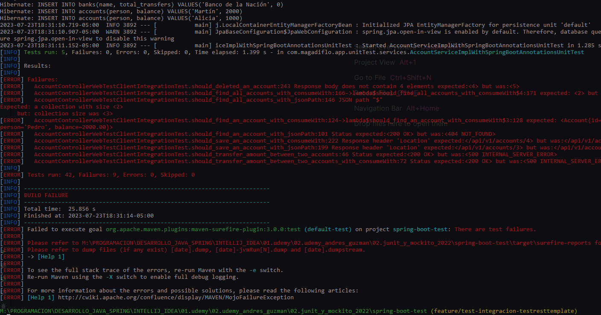

Como observamos en la imagen anterior, al ejecutar todos nuestros test mediante consola, la clase de prueba
**AccountControllerWebTestClientIntegrationTest** nos arroja errores en sus comprobaciones. Entonces para solucionarlo
podemos **excluir**
esta clase de prueba, ya que tenemos la clase de prueba **AccountControllerTestRestTemplateIntegrationTest** que
prueba las mismas cosas pero usando su propio archivo sql. Entonces para ejecutar el test completo excluyendo
la clase de test mencionada, ejecutamos:

````bash
mvnw test -Dgroups="!integration_test_webtestclient"
````

**NOTA**
> No he investigado por qué ocurre este error en consola, pero supongo que es porque la clase está usando el archivo
> **import.sql** para hacer los test, pero también tenemos otras clases test que usan el mismo archivo, eso provoca que
> las afirmaciones no sean correctas, ya que los datos son modificados por varias clases.
>
> Aunque, si ejecutamos todos los test desde el **IDE IntelliJ IDEA** no ocurre el mismo problema, allí sí se ejecutan
> todos los test exitosamente.

## Solución al error de caracteres especiales en consola

Puede que al ejecutar el test mediante consola nos salgan errores producto de la codificación de caracteres, tal como se
ve en la siguiente imagen:

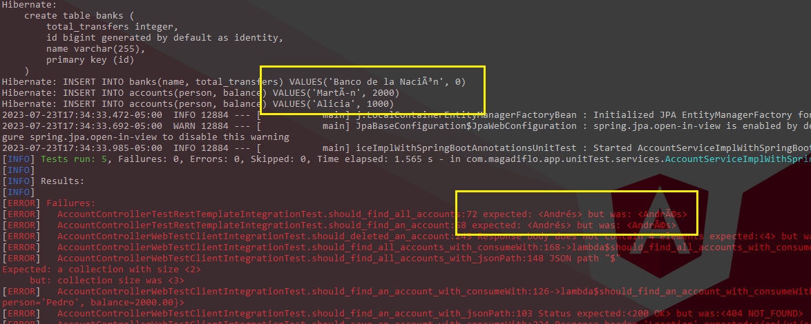

Entonces, para solucionar esto, debemos cambiar el tipo de codificación de caractereres, **solo de los archivos que usen
los caracteres especiales, ya que ellos son los que provocan este error**, como el **import.sql y el
test-account-data.sql** ubicados en **/test/resources**.

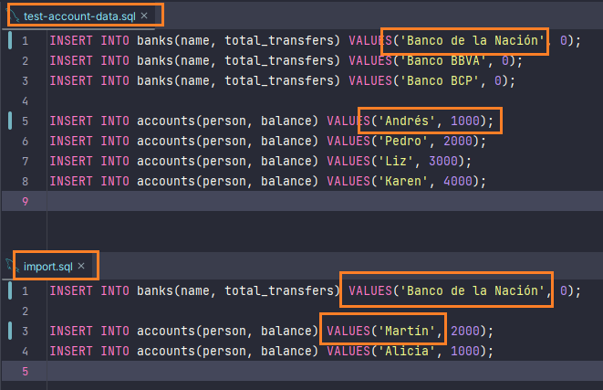

Si nuestros test usan el archivo **import.sql** del **/main/resources/** y este también contiene caracteres especiales,
por consiguiente también deberíamos hacer lo mismo:

Para cambiar el tipo de codificación hacemos lo siguiente:

- Seleccionamos el archivo a cambiar la codificación, por ejemplo **import.sql** luego vamos a
  ``File/File Properties/File Encoding``
- Seleccionamos **ISO-8859-1** y clic en **Convert**
- Para comprobar que se realizó el cambio, abrimos el archivo **import.sql** y observamos en la parte inferior el tipo
  de codificación del archivo, tal como se ve en la siguiente imagen:

  

Listo, ahora ejecutamos los test nuevamente y todo debería funcionar correctamente:

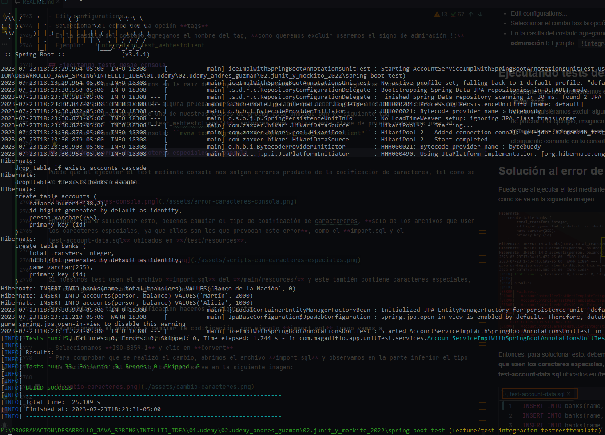

**IMPORTANTE**

> Si vamos a volver a realizar los test desde el **IDE IntelliJ IDEA**, debemos convertir los archivos a sus caracteres
> originales **(UTF-8)** sino las pruebas ejecutadas con el IDE fallarán.
>

---

# Pruebas de Integración a nuestro controller usando MockMvc

En secciones anteriores realizamos **Pruebas Unitarias** a nuestro controlador **AccountController** utilizando
**MockMvc**. Decíamos que esta clase se puede **utilizar para invocar al controlador simulando la llamada HTTP sin tener
que arrancar realmente ningún servidor web**, es decir simulábamos el **request y response**. Además, nos apoyábamos de
la anotación **@MockBean** para simular la dependencia **IAccountService** que requiere este controlador y a través del
uso de **Mockito** simulamos la respuesta que nos debería retornar cuando algún método de esta dependencia fuese
llamada.

Pues bien, en esta sección volveremos a usar **MockMvc** para poder realizar solicitudes **HTTP** al controlador
**AccountController**, pero en esta oportunidad realizaremos **Pruebas de Integración**, es decir, se ejecutará nuestro
código desde la primera capa donde se expone nuestros datos (end points), hasta la última capa donde se recogen los
datos o manipulan los datos obtenidos de la Base de Datos. Para que esto funcione es necesario utilizar algunas
anotaciones **distintas al que usamos en la realización de pruebas unitarias**.

A continuación se mostrarán las anotaciones más relevantes:

### @SpringBootTest

En secciones superiores explicábamos el uso de esta anotación, pero solo para recordar decíamos que **Spring Boot
proporciona esta anotación (@SpringBootTest) para realizar pruebas de integración. Esta anotación crea un contexto
de aplicación y carga el contexto completo de la aplicación.**

### webEnvironment = SpringBootTest.WebEnvironment.RANDOM_PORT

Esta propiedad corresponde a la anotación **@SpringBootTest()**, y decíamos que selecciona un puerto aleatorio para el
servidor web durante la prueba.

### @AutoConfigureMockMvc

Anotación que se puede aplicar a una clase de prueba para habilitar y **configurar la configuración automática de
MockMvc.**

### MockMvc

En secciones anteriores decíamos que **MockMvc ofrece una interfaz para realizar solicitudes HTTP (GET, POST, PUT,
DELETE, etc.) a los endpoints de nuestros controladores y obtener las respuestas simuladas**. Ahora, en este caso
ya no obtendremos respuestas simuladas, sino respuestas reales con datos reales, pues las llamadas HTTP se realizarán
a nuestro servidor de pruebas que se crea gracias a la anotación **@SpringBootTest**.

Finalmente, nuestra clase de prueba de integración utilizando MockMvc quedaría de la siguiente manera:

````java

@Sql(scripts = {"/test-account-cleanup.sql", "/test-account-data.sql"}, executionPhase = Sql.ExecutionPhase.BEFORE_TEST_METHOD)
@SpringBootTest(webEnvironment = SpringBootTest.WebEnvironment.RANDOM_PORT)
@AutoConfigureMockMvc
class AccountControllerMockMvcIntegrationTest {
    @Autowired
    private MockMvc mockMvc;
    @Autowired
    private ObjectMapper objectMapper;
    @LocalServerPort
    private int port;

    @Test
    void should_find_all_accounts() throws Exception {
        ResultActions response = this.mockMvc.perform(MockMvcRequestBuilders.get(this.createAbsolutePath("/api/v1/accounts")));

        response.andExpect(MockMvcResultMatchers.status().isOk())
                .andExpect(MockMvcResultMatchers.jsonPath("$.size()", Matchers.is(4)))
                .andExpect(MockMvcResultMatchers.jsonPath("$", Matchers.hasSize(4)))
                .andExpect(MockMvcResultMatchers.jsonPath("$[0].person").value("Andrés"))
                .andExpect(MockMvcResultMatchers.jsonPath("$[1].person").value("Pedro"))
                .andExpect(MockMvcResultMatchers.jsonPath("$[2].person").value("Liz"))
                .andExpect(MockMvcResultMatchers.jsonPath("$[3].person").value("Karen"));
    }

    @Test
    void should_find_an_account() throws Exception {
        ResultActions response = this.mockMvc.perform(MockMvcRequestBuilders.get(this.createAbsolutePath("/api/v1/accounts/{id}"), 1));
        response.andExpect(MockMvcResultMatchers.status().isOk())
                .andExpect(MockMvcResultMatchers.content().contentType(MediaType.APPLICATION_JSON))
                .andExpect(MockMvcResultMatchers.jsonPath("$.id").value(1))
                .andExpect(MockMvcResultMatchers.jsonPath("$.person").value("Andrés"))
                .andExpect(MockMvcResultMatchers.jsonPath("$.balance").value(1000));
    }

    @Test
    void should_return_empty_when_account_does_not_exist() throws Exception {
        // Given
        Long accountId = 10L;

        // When
        ResultActions response = this.mockMvc.perform(MockMvcRequestBuilders.get("/api/v1/accounts/{id}", accountId));

        // Then
        response.andExpect(MockMvcResultMatchers.status().isNotFound());
    }

    @Test
    void should_transfer_an_amount_between_accounts() throws Exception {
        // Given
        TransactionDTO dto = new TransactionDTO(1L, 1L, 2L, new BigDecimal("1000"));

        // When
        ResultActions response = this.mockMvc.perform(MockMvcRequestBuilders.post("/api/v1/accounts/transfer")
                .contentType(MediaType.APPLICATION_JSON)
                .content(this.objectMapper.writeValueAsString(dto)));

        // Then
        response.andExpect(MockMvcResultMatchers.status().isOk())
                .andExpect(MockMvcResultMatchers.content().contentType(MediaType.APPLICATION_JSON))
                .andExpect(MockMvcResultMatchers.jsonPath("$.code").value(HttpStatus.OK.value()))
                .andExpect(MockMvcResultMatchers.jsonPath("$.datetime").exists())
                .andExpect(MockMvcResultMatchers.jsonPath("$.message").value("transferencia exitosa"))
                .andExpect(MockMvcResultMatchers.jsonPath("$.transaction.accountIdOrigin").value(dto.accountIdOrigin()));

        String jsonResponse = response.andReturn().getResponse().getContentAsString();
        JsonNode jsonNode = this.objectMapper.readTree(jsonResponse);

        String dateTime = jsonNode.get("datetime").asText();
        LocalDateTime localDateTime = LocalDateTime.parse(dateTime);

        assertEquals(LocalDate.now(), localDateTime.toLocalDate());
    }

    @Test
    void should_save_an_account() throws Exception {
        // Given
        Long idDB = 5L;
        Account account = new Account(null, "Martín", new BigDecimal("2000"));

        // When
        ResultActions response = this.mockMvc.perform(MockMvcRequestBuilders.post("/api/v1/accounts")
                .contentType(MediaType.APPLICATION_JSON)
                .content(this.objectMapper.writeValueAsString(account)));

        // Then
        response.andExpect(MockMvcResultMatchers.status().isCreated())
                .andExpect(MockMvcResultMatchers.content().contentType(MediaType.APPLICATION_JSON))
                .andExpect(MockMvcResultMatchers.header().string("Location", "/api/v1/accounts/" + idDB))
                .andExpect(MockMvcResultMatchers.jsonPath("$.id", Matchers.is(idDB.intValue())))
                .andExpect(MockMvcResultMatchers.jsonPath("$.person", Matchers.is("Martín")))
                .andExpect(MockMvcResultMatchers.jsonPath("$.balance", Matchers.is(2000)));
    }

    @Test
    void should_delete_an_account() throws Exception {
        ResultActions responseDelete = this.mockMvc.perform(MockMvcRequestBuilders.delete(this.createAbsolutePath("/api/v1/accounts/{id}"), 1));
        responseDelete.andExpect(MockMvcResultMatchers.status().isNoContent());

        ResultActions responseGet = this.mockMvc.perform(MockMvcRequestBuilders.get(this.createAbsolutePath("/api/v1/accounts/{id}"), 1));
        responseGet.andExpect(MockMvcResultMatchers.status().isNotFound());
    }

    private String createAbsolutePath(String uri) {
        return String.format("http://localhost:%d%s", this.port, uri);
    }
}
````
